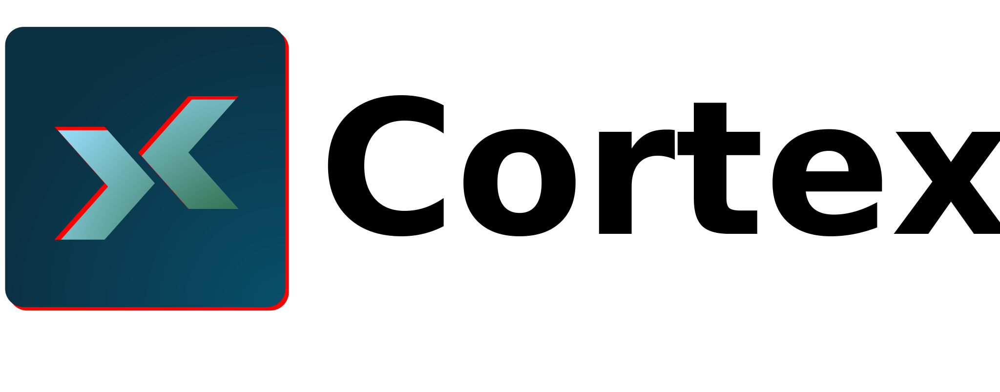
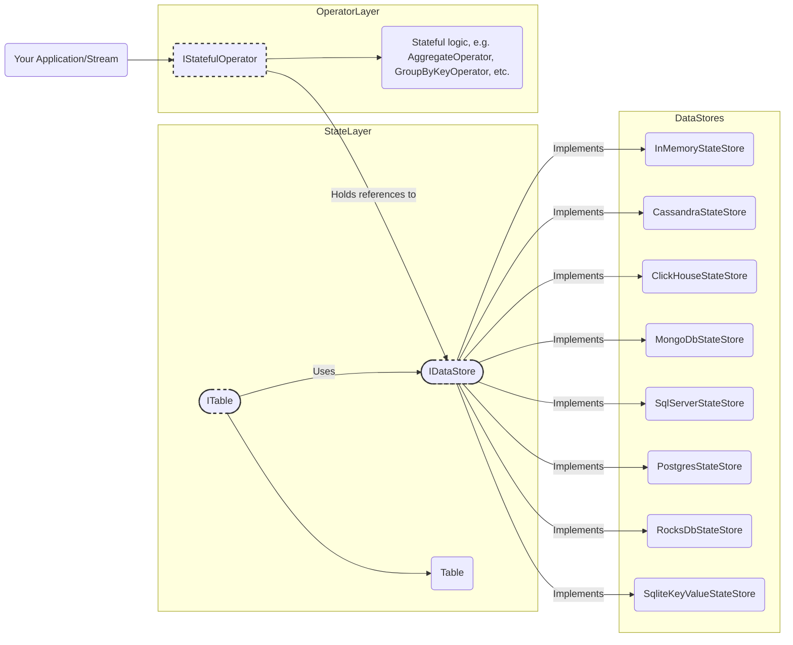

## Welcome to Cortex Data Framework

###  Welcome to the Future of Real-Time Data Processing!

We’re thrilled to have you explore **Cortex Data Framework** — a cutting-edge SDK designed to transform the way developers create and manage real-time data pipelines. Whether you’re a seasoned developer or just starting with stream processing, Cortex offers a simple yet powerful way to handle data at scale.

## What is Cortex Data Framework?

The Cortex Data Framework is a powerful, modular, and developer-friendly SDK designed to streamline the creation and management of real-time data processing pipelines. Built with scalability, efficiency, and extensibility in mind, Cortex empowers developers to build complex data streaming applications while abstracting low-level details.

With Cortex, you can focus on crafting robust pipelines that transform, aggregate, and analyze data in real-time, without getting bogged down by the intricacies of state management, concurrency, or integration.

### Key Features

1. **Stream Processing Simplified** : 
Cortex provides intuitive APIs for defining sources, sinks, and operators, enabling seamless pipeline creation with minimal boilerplate code.

2. **Rich State Management** :
Includes out-of-the-box support for in-memory and persistent state stores (e.g., RocksDB) to handle stateful computations like aggregations and windowing.

3. **Built-in Operators** :
Offers a variety of prebuilt operators, including:

   * **Transformation** (Map)
   * **Filtering** (Filter)
   * **Aggregations** (GroupBy, Aggregate)
   * **Windowing** (Tumbling, Sliding, Session Windows)
   * **Extensible** and Customizable

Developers can easily create custom operators, state stores, or telemetry integrations tailored to specific needs.

4. **Telemetry and Monitoring**
Integrates with industry-standard telemetry frameworks (e.g., OpenTelemetry) for real-time metrics, logging, and tracing.

5. **Error Resilience**
Built-in mechanisms for handling errors gracefully during pipeline execution.

### Why Use Cortex?
1. **Developer Efficiency**
: Cortex’s abstraction layer reduces development complexity, allowing you to build and iterate faster on data-intensive applications.

2. **Scalability and Performance**
: With support for scalable state stores and efficient operator chaining, Cortex ensures high throughput and low latency, even under heavy data loads.

3. **Flexible Architecture**
: The framework can be integrated into existing systems or used to design entirely new data workflows, making it a versatile tool for a wide range of industries.

4. **Production Ready**
: Designed for real-world scenarios, Cortex handles concurrency, persistence, and fault tolerance with ease, making it ready for deployment in mission-critical environments.

### Core Use Cases

* **Real-Time Analytics**: Build pipelines to analyze data streams, such as user activity logs or IoT sensor readings, in real-time.
* **Event-Driven Systems**: Process events dynamically, triggering actions based on business rules or aggregated data.
* **Session Management**: Manage stateful sessions for applications like chat systems or gaming platforms.
* **Streaming Data Transformation**: Transform incoming data streams into enriched formats for downstream systems.

### How Cortex Fits in the Data Ecosystem

Cortex seamlessly integrates with your existing architecture:

* **Data Sources**: Connects to a variety of data sources, including message brokers like Kafka or custom source operators.
* **State Management**: Supports persistence using RocksDB or in-memory state stores for low-latency operations.
* **Monitoring Tools**: Works with telemetry systems to provide deep insights into pipeline health and performance.

Whether you’re an engineer looking to simplify complex stream processing workflows or a data scientist aiming to operationalize data models, Cortex provides the building blocks for success.

