# Architecture Overview

This document provides a high-level overview of **Cortex.Mediator**'s architecture, design patterns, and how the components interact.

## High-Level Architecture

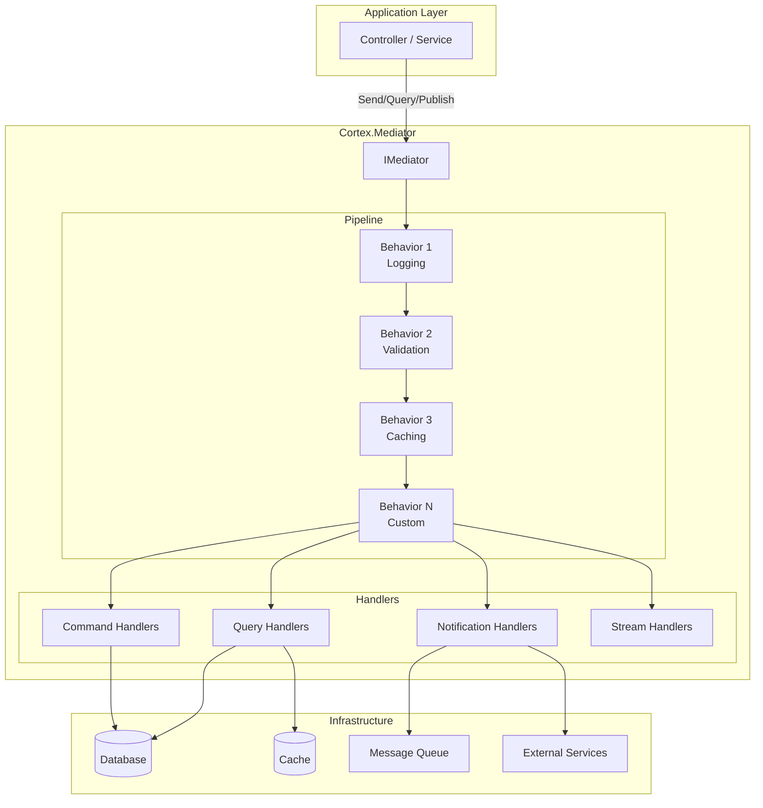

## Request Flow

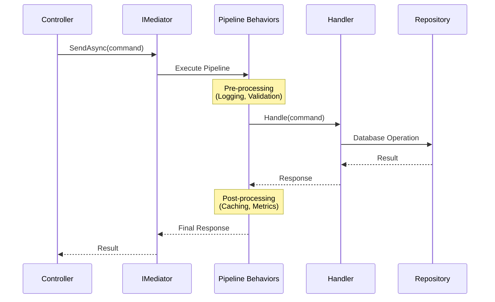

## Core Components

### 1. IMediator Interface

The central hub that routes requests to appropriate handlers.

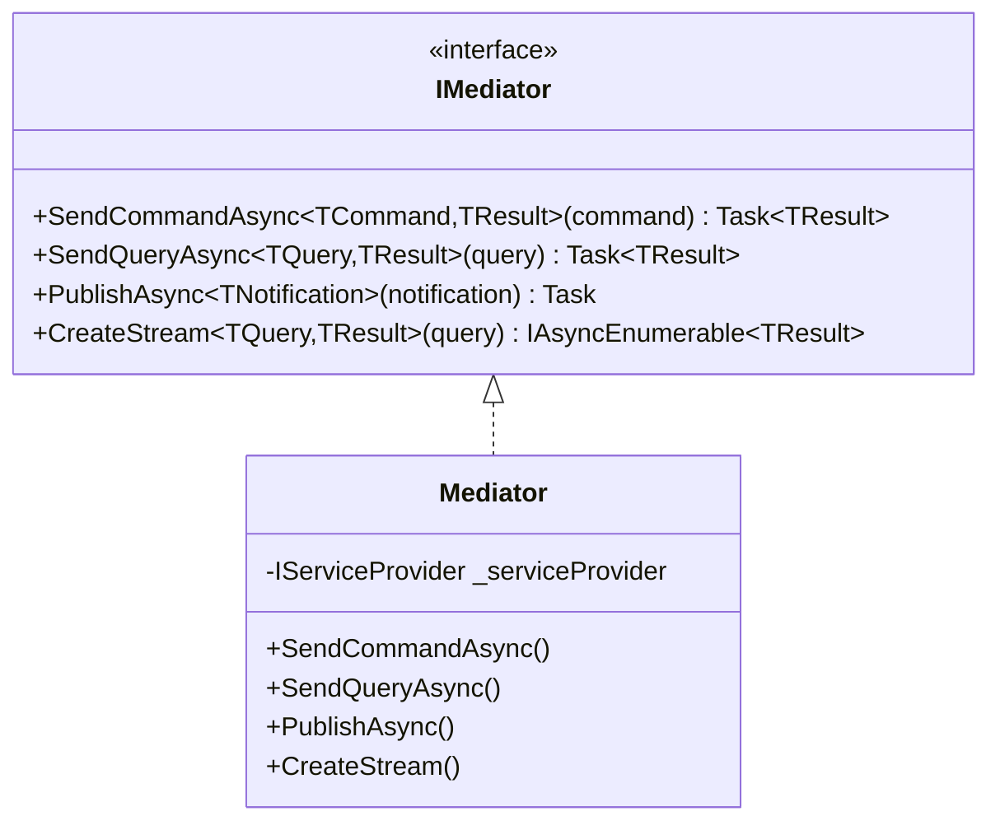

### 2. Commands, Queries, and Notifications

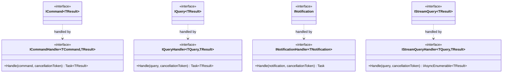

### 3. Pipeline Behaviors

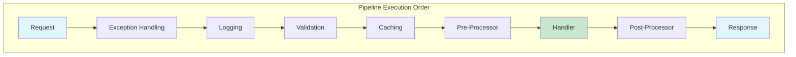

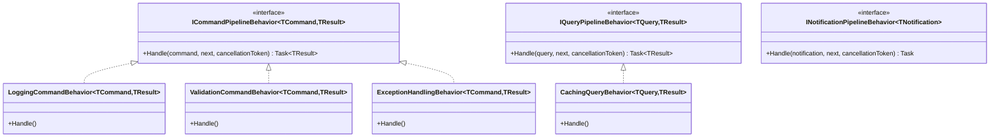

## CQRS Pattern Implementation

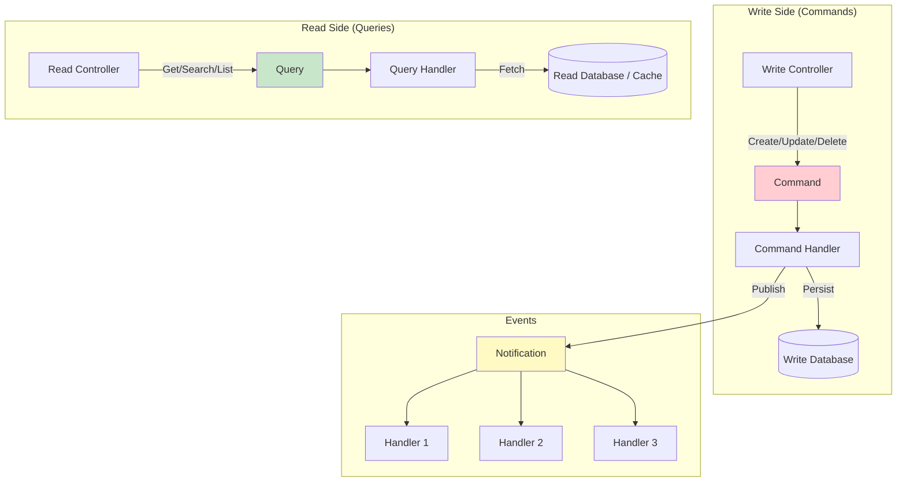

## Notification Fan-Out Pattern

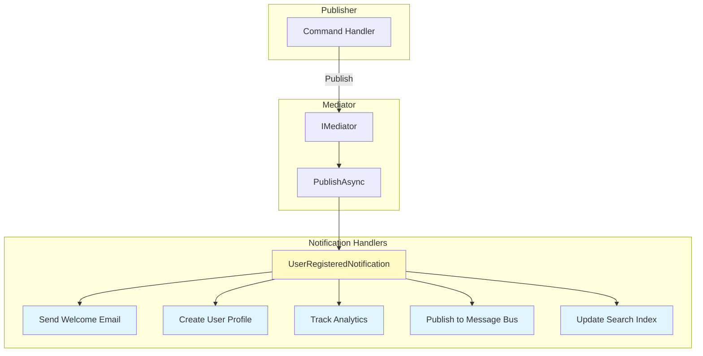

## Caching Architecture

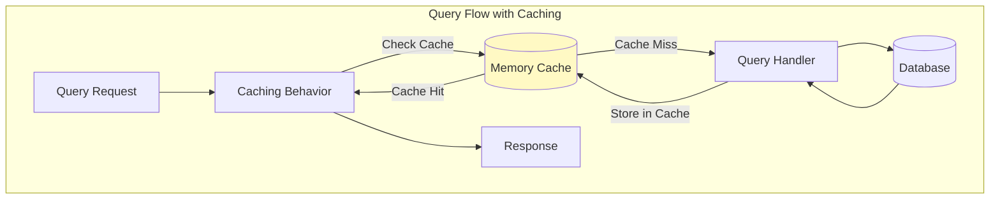

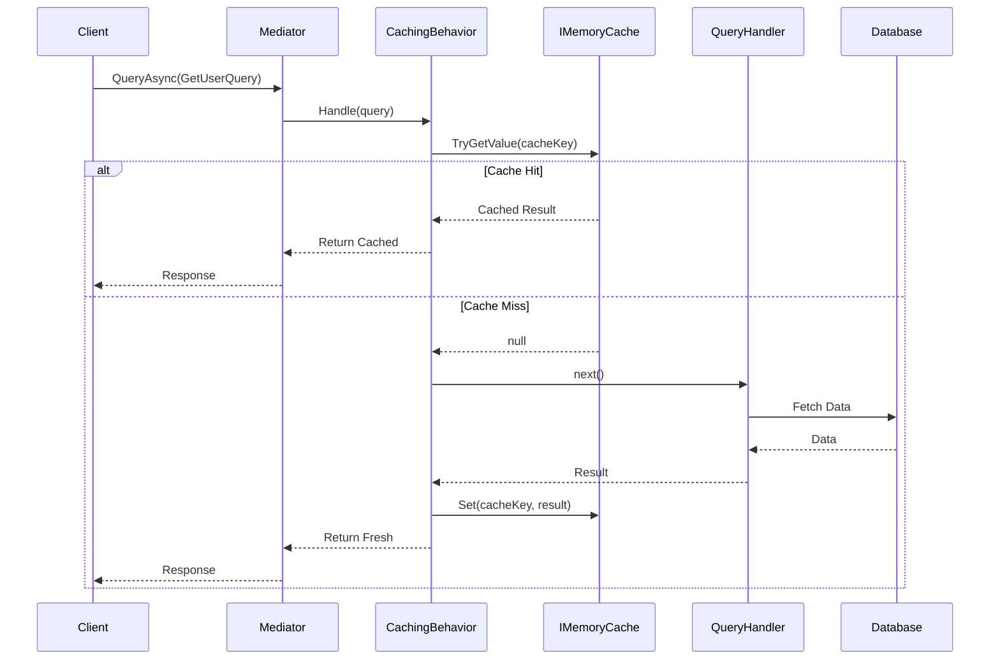

## Exception Handling Flow

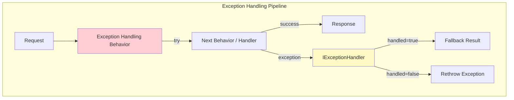

## Dependency Injection Structure

```mermaid
graph TB
    subgraph "Service Registration"
        SC[ServiceCollection]
        
        subgraph "Core Services"
            MED[IMediator → Mediator]
        end
        
        subgraph "Handlers (Auto-Discovered)"
            CH[ICommandHandler<,>]
            QH[IQueryHandler<,>]
            NH[INotificationHandler<>]
            SH[IStreamQueryHandler<,>]
        end
        
        subgraph "Behaviors (Ordered)"
            B1[ExceptionHandlingBehavior]
            B2[LoggingBehavior]
            B3[ValidationBehavior]
            B4[CachingBehavior]
        end
        
        subgraph "Optional Services"
            VAL[IValidator<>]
            CACHE[IMemoryCache]
            EXCEPT[IExceptionHandler]
        end
    end
    
    SC --> MED
    SC --> CH
    SC --> QH
    SC --> NH
    SC --> SH
    SC --> B1
    SC --> B2
    SC --> B3
    SC --> B4
    SC --> VAL
    SC --> CACHE
    SC --> EXCEPT
```

## Streaming Query Architecture

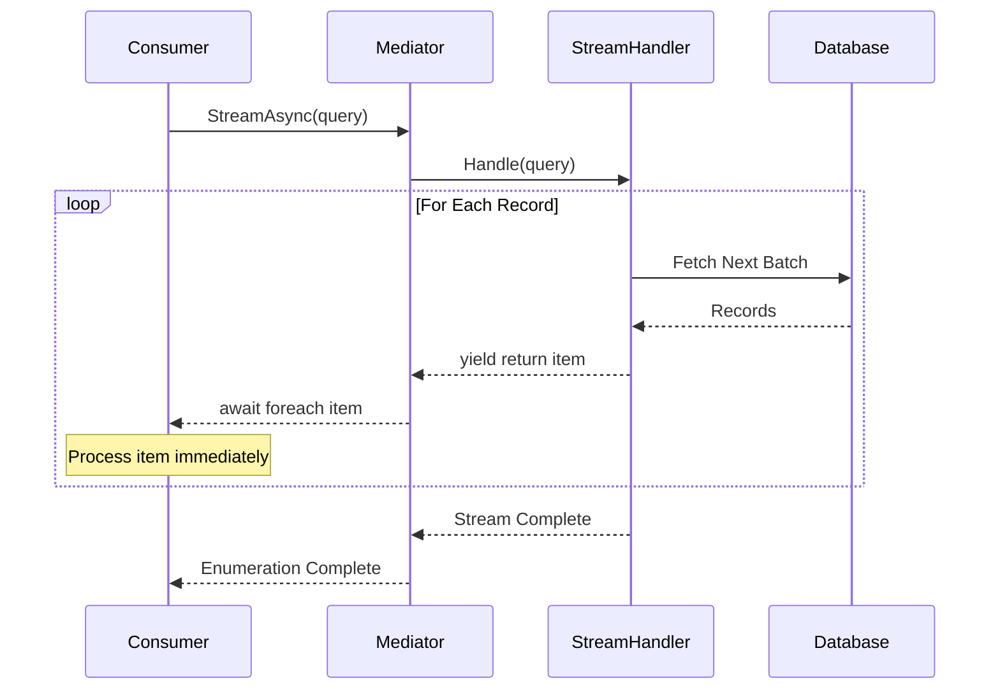

## Vertical Slice Architecture

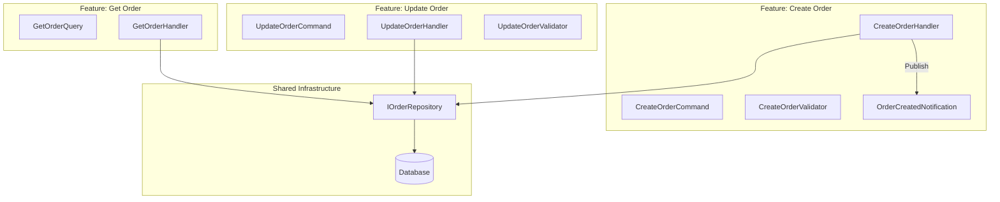

## Request Types Comparison

| Aspect | Command | Query | Notification | Stream Query |
|--------|---------|-------|--------------|--------------|
| **Purpose** | Change state | Read data | Broadcast event | Stream large data |
| **Return Value** | Optional | Required | None | IAsyncEnumerable |
| **Handlers** | Exactly one | Exactly one | Zero or more | Exactly one |
| **Side Effects** | Yes | No | Yes | No |
| **Cacheable** | No | Yes | No | No |
| **Example** | CreateOrder | GetOrderById | OrderCreated | ExportAllOrders |

## Design Principles

### Single Responsibility
Each handler does one thing and does it well.

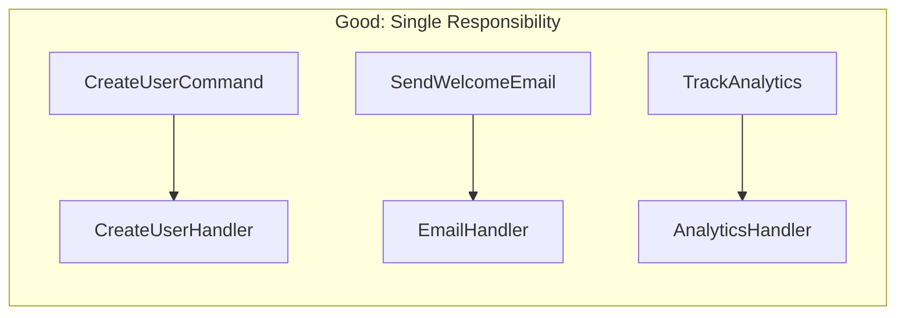

### Open/Closed Principle
Add new features without modifying existing code.

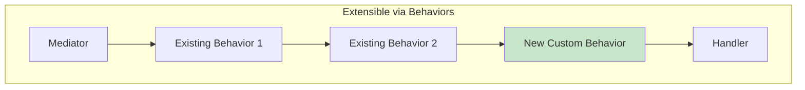

## Performance Considerations

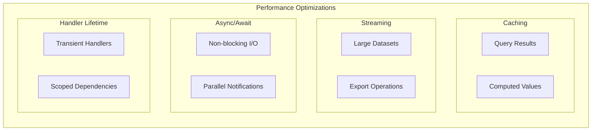
