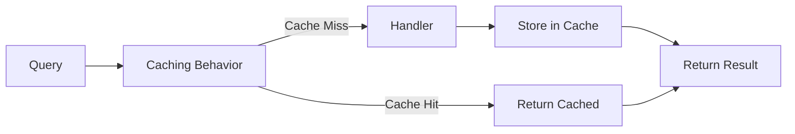

# Caching

Cortex.Mediator provides built-in caching support for query results, helping improve performance by avoiding redundant database calls and expensive computations.

The caching system works through a pipeline behavior that automatically caches query results based on configuration.



## Setup

### 1. Install Dependencies

```bash
dotnet add package Microsoft.Extensions.Caching.Memory
```

### 2. Configure Caching Services

```csharp
// Add memory cache
builder.Services.AddMemoryCache();

// Configure mediator caching
builder.Services.AddMediatorCaching(options =>
{
    options.DefaultAbsoluteExpiration = TimeSpan.FromMinutes(5);
    options.DefaultSlidingExpiration = TimeSpan.FromMinutes(1);
    options.CacheKeyPrefix = "MyApp";
});

// Register mediator with caching behavior
builder.Services.AddCortexMediator(
    new[] { typeof(Program).Assembly },
    options => options.AddCachingBehavior()
);
```

### Full Configuration Options

```csharp
builder.Services.AddMediatorCaching(options =>
{
    // Default expiration when not specified on query
    options.DefaultAbsoluteExpiration = TimeSpan.FromMinutes(10);
    options.DefaultSlidingExpiration = TimeSpan.FromMinutes(2);
    
    // Prefix for all cache keys (useful for multi-tenant or versioning)
    options.CacheKeyPrefix = "MyApp_v1";
    
    // Enable/disable caching globally
    options.Enabled = true;
});
```

## Making Queries Cacheable

### Option 1: Using the [Cacheable] Attribute

The simplest way to enable caching for a query:

```csharp
using Cortex.Mediator.Caching;
using Cortex.Mediator.Queries;

[Cacheable(AbsoluteExpirationSeconds = 300, SlidingExpirationSeconds = 60)]
public class GetProductByIdQuery : IQuery<ProductDto>
{
    public Guid ProductId { get; set; }
}
```

#### Attribute Options

```csharp
[Cacheable(
    AbsoluteExpirationSeconds = 300,  // Cache expires after 5 minutes
    SlidingExpirationSeconds = 60,     // Reset expiration on each access
    CacheKeyPrefix = "product"         // Custom cache key prefix
)]
public class GetProductQuery : IQuery<ProductDto>
{
    public Guid ProductId { get; set; }
}
```

### Option 2: Implementing ICacheableQuery Interface

For more control over caching behavior:

```csharp
using Cortex.Mediator.Caching;
using Cortex.Mediator.Queries;

public class GetUserProfileQuery : IQuery<UserProfileDto>, ICacheableQuery
{
    public Guid UserId { get; set; }

    // Custom cache key for this specific query instance
    public string? CacheKey => $"user-profile-{UserId}";
    
    // Override default expiration
    public TimeSpan? AbsoluteExpiration => TimeSpan.FromMinutes(15);
    public TimeSpan? SlidingExpiration => TimeSpan.FromMinutes(5);
}
```

### Option 3: Combining Both

```csharp
[Cacheable(AbsoluteExpirationSeconds = 600)] // Default settings
public class SearchProductsQuery : IQuery<List<ProductDto>>, ICacheableQuery
{
    public string SearchTerm { get; set; }
    public string Category { get; set; }
    public int Page { get; set; }

    // Custom cache key based on all parameters
    public string? CacheKey => $"products-search-{SearchTerm}-{Category}-{Page}";
    
    // Use attribute defaults
    public TimeSpan? AbsoluteExpiration => null;
    public TimeSpan? SlidingExpiration => null;
}
```

## Cache Key Generation

### Default Key Generation

By default, cache keys are generated using:
- Query type name
- All public property values (serialized)

```csharp
// Query
public class GetUserQuery : IQuery<UserDto>
{
    public Guid UserId { get; set; }
}

// Generated cache key: "MyApp:GetUserQuery:{"UserId":"abc123..."}"
```

### Custom Cache Key Generator

Implement `ICacheKeyGenerator` for custom key generation:

```csharp
using Cortex.Mediator.Caching;

public class CustomCacheKeyGenerator : ICacheKeyGenerator
{
    public string GenerateKey<TQuery, TResult>(TQuery query) 
        where TQuery : IQuery<TResult>
    {
        var queryName = typeof(TQuery).Name;
        
        // Use reflection or pattern matching for custom keys
        if (query is ICacheableQuery cacheable && !string.IsNullOrEmpty(cacheable.CacheKey))
        {
            return $"MyApp:{cacheable.CacheKey}";
        }

        // Default: use hash of serialized query
        var json = JsonSerializer.Serialize(query);
        var hash = ComputeHash(json);
        
        return $"MyApp:{queryName}:{hash}";
    }

    private string ComputeHash(string input)
    {
        using var sha256 = SHA256.Create();
        var bytes = Encoding.UTF8.GetBytes(input);
        var hash = sha256.ComputeHash(bytes);
        return Convert.ToBase64String(hash)[..16]; // Short hash
    }
}

// Register custom generator
builder.Services.AddMediatorCaching<CustomCacheKeyGenerator>();
```

## Cache Invalidation

### Using ICacheInvalidator

```csharp
using Cortex.Mediator.Caching;

public class UpdateProductCommandHandler : ICommandHandler<UpdateProductCommand, Unit>
{
    private readonly IProductRepository _productRepository;
    private readonly ICacheInvalidator _cacheInvalidator;

    public UpdateProductCommandHandler(
        IProductRepository productRepository,
        ICacheInvalidator cacheInvalidator)
    {
        _productRepository = productRepository;
        _cacheInvalidator = cacheInvalidator;
    }

    public async Task<Unit> Handle(
        UpdateProductCommand command,
        CancellationToken cancellationToken)
    {
        // Update product
        var product = await _productRepository.GetByIdAsync(command.ProductId, cancellationToken);
        product.Name = command.Name;
        product.Price = command.Price;
        
        await _productRepository.UpdateAsync(product, cancellationToken);
        await _productRepository.SaveChangesAsync(cancellationToken);

        // Invalidate the cached query result
        _cacheInvalidator.Invalidate<GetProductByIdQuery, ProductDto>(
            new GetProductByIdQuery { ProductId = command.ProductId });

        // Invalidate related cached queries
        _cacheInvalidator.InvalidateByPrefix("products-list");
        _cacheInvalidator.InvalidateByPrefix("products-search");

        return Unit.Value;
    }
}
```

### ICacheInvalidator Methods

```csharp
public interface ICacheInvalidator
{
    /// <summary>
    /// Invalidate cache for a specific query instance.
    /// </summary>
    void Invalidate<TQuery, TResult>(TQuery query) where TQuery : IQuery<TResult>;

    /// <summary>
    /// Invalidate all cache entries with the specified prefix.
    /// </summary>
    void InvalidateByPrefix(string prefix);

    /// <summary>
    /// Invalidate all cache entries for a query type.
    /// </summary>
    void InvalidateByType<TQuery>() where TQuery : class;

    /// <summary>
    /// Clear all cached query results.
    /// </summary>
    void InvalidateAll();
}
```

### Invalidation via Notification Handlers

```csharp
public class ProductUpdatedNotification : INotification
{
    public Guid ProductId { get; set; }
    public string Category { get; set; }
}

public class InvalidateProductCacheHandler : INotificationHandler<ProductUpdatedNotification>
{
    private readonly ICacheInvalidator _cacheInvalidator;

    public InvalidateProductCacheHandler(ICacheInvalidator cacheInvalidator)
    {
        _cacheInvalidator = cacheInvalidator;
    }

    public Task Handle(
        ProductUpdatedNotification notification,
        CancellationToken cancellationToken)
    {
        // Invalidate specific product
        _cacheInvalidator.Invalidate<GetProductByIdQuery, ProductDto>(
            new GetProductByIdQuery { ProductId = notification.ProductId });

        // Invalidate category listings
        _cacheInvalidator.InvalidateByPrefix($"products-category-{notification.Category}");

        return Task.CompletedTask;
    }
}
```

## Real-World Examples

### Example 1: User Profile with Related Data

```csharp
[Cacheable(AbsoluteExpirationSeconds = 300)]
public class GetUserDashboardQuery : IQuery<UserDashboardDto>, ICacheableQuery
{
    public Guid UserId { get; set; }

    public string? CacheKey => $"dashboard-{UserId}";
    public TimeSpan? AbsoluteExpiration => null; // Use attribute default
    public TimeSpan? SlidingExpiration => TimeSpan.FromMinutes(2);
}

public class UserDashboardDto
{
    public UserProfileDto Profile { get; set; }
    public List<RecentOrderDto> RecentOrders { get; set; }
    public DashboardStatsDto Stats { get; set; }
    public List<NotificationDto> Notifications { get; set; }
}

public class GetUserDashboardQueryHandler : IQueryHandler<GetUserDashboardQuery, UserDashboardDto>
{
    private readonly IUserRepository _userRepository;
    private readonly IOrderRepository _orderRepository;
    private readonly IStatsService _statsService;
    private readonly ILogger<GetUserDashboardQueryHandler> _logger;

    public GetUserDashboardQueryHandler(
        IUserRepository userRepository,
        IOrderRepository orderRepository,
        IStatsService statsService,
        ILogger<GetUserDashboardQueryHandler> logger)
    {
        _userRepository = userRepository;
        _orderRepository = orderRepository;
        _statsService = statsService;
        _logger = logger;
    }

    public async Task<UserDashboardDto> Handle(
        GetUserDashboardQuery query,
        CancellationToken cancellationToken)
    {
        _logger.LogInformation(
            "Fetching dashboard for user {UserId} (cache miss)",
            query.UserId);

        // This is an expensive operation - results will be cached
        var user = await _userRepository.GetByIdWithDetailsAsync(
            query.UserId, 
            cancellationToken);

        var recentOrders = await _orderRepository.GetRecentOrdersAsync(
            query.UserId, 
            10, 
            cancellationToken);

        var stats = await _statsService.CalculateUserStatsAsync(
            query.UserId, 
            cancellationToken);

        return new UserDashboardDto
        {
            Profile = MapToProfileDto(user),
            RecentOrders = recentOrders.Select(MapToOrderDto).ToList(),
            Stats = stats,
            Notifications = user.Notifications
                .OrderByDescending(n => n.CreatedAt)
                .Take(5)
                .Select(MapToNotificationDto)
                .ToList()
        };
    }

    // Mapping methods...
}

// Invalidate when user data changes
public class UserUpdatedHandler : INotificationHandler<UserUpdatedNotification>
{
    private readonly ICacheInvalidator _cacheInvalidator;

    public UserUpdatedHandler(ICacheInvalidator cacheInvalidator)
    {
        _cacheInvalidator = cacheInvalidator;
    }

    public Task Handle(UserUpdatedNotification notification, CancellationToken cancellationToken)
    {
        _cacheInvalidator.InvalidateByPrefix($"dashboard-{notification.UserId}");
        return Task.CompletedTask;
    }
}
```

### Example 2: Configuration/Settings Cache

```csharp
[Cacheable(AbsoluteExpirationSeconds = 3600)] // 1 hour
public class GetSystemSettingsQuery : IQuery<SystemSettingsDto>, ICacheableQuery
{
    public string? CacheKey => "system-settings";
    public TimeSpan? AbsoluteExpiration => TimeSpan.FromHours(1);
    public TimeSpan? SlidingExpiration => null; // No sliding
}

public class SystemSettingsDto
{
    public Dictionary<string, string> Settings { get; set; }
    public DateTime LastUpdated { get; set; }
}

public class GetSystemSettingsQueryHandler : IQueryHandler<GetSystemSettingsQuery, SystemSettingsDto>
{
    private readonly ISettingsRepository _settingsRepository;

    public GetSystemSettingsQueryHandler(ISettingsRepository settingsRepository)
    {
        _settingsRepository = settingsRepository;
    }

    public async Task<SystemSettingsDto> Handle(
        GetSystemSettingsQuery query,
        CancellationToken cancellationToken)
    {
        var settings = await _settingsRepository.GetAllAsync(cancellationToken);
        
        return new SystemSettingsDto
        {
            Settings = settings.ToDictionary(s => s.Key, s => s.Value),
            LastUpdated = settings.Max(s => s.UpdatedAt)
        };
    }
}

// Admin API to update settings
public class UpdateSettingCommandHandler : ICommandHandler<UpdateSettingCommand, Unit>
{
    private readonly ISettingsRepository _settingsRepository;
    private readonly ICacheInvalidator _cacheInvalidator;

    public UpdateSettingCommandHandler(
        ISettingsRepository settingsRepository,
        ICacheInvalidator cacheInvalidator)
    {
        _settingsRepository = settingsRepository;
        _cacheInvalidator = cacheInvalidator;
    }

    public async Task<Unit> Handle(
        UpdateSettingCommand command,
        CancellationToken cancellationToken)
    {
        await _settingsRepository.UpdateAsync(command.Key, command.Value, cancellationToken);

        // Invalidate settings cache
        _cacheInvalidator.Invalidate<GetSystemSettingsQuery, SystemSettingsDto>(
            new GetSystemSettingsQuery());

        return Unit.Value;
    }
}
```

### Example 3: Search Results with Pagination

```csharp
[Cacheable(AbsoluteExpirationSeconds = 120)] // 2 minutes
public class SearchProductsQuery : IQuery<PagedResult<ProductDto>>, ICacheableQuery
{
    public string SearchTerm { get; set; }
    public string Category { get; set; }
    public decimal? MinPrice { get; set; }
    public decimal? MaxPrice { get; set; }
    public string SortBy { get; set; } = "name";
    public bool SortDescending { get; set; }
    public int Page { get; set; } = 1;
    public int PageSize { get; set; } = 20;

    // Generate unique cache key for this search combination
    public string? CacheKey => 
        $"products-search-" +
        $"{SearchTerm?.ToLower() ?? "all"}-" +
        $"{Category?.ToLower() ?? "all"}-" +
        $"{MinPrice ?? 0}-{MaxPrice ?? 0}-" +
        $"{SortBy}-{SortDescending}-" +
        $"{Page}-{PageSize}";

    public TimeSpan? AbsoluteExpiration => null;
    public TimeSpan? SlidingExpiration => TimeSpan.FromMinutes(1);
}

public class SearchProductsQueryHandler 
    : IQueryHandler<SearchProductsQuery, PagedResult<ProductDto>>
{
    private readonly IProductRepository _productRepository;
    private readonly ILogger<SearchProductsQueryHandler> _logger;

    public SearchProductsQueryHandler(
        IProductRepository productRepository,
        ILogger<SearchProductsQueryHandler> logger)
    {
        _productRepository = productRepository;
        _logger = logger;
    }

    public async Task<PagedResult<ProductDto>> Handle(
        SearchProductsQuery query,
        CancellationToken cancellationToken)
    {
        _logger.LogInformation(
            "Executing search query: {SearchTerm} in {Category} (cache miss)",
            query.SearchTerm,
            query.Category);

        // Complex search operation - results cached
        var result = await _productRepository.SearchAsync(
            query.SearchTerm,
            query.Category,
            query.MinPrice,
            query.MaxPrice,
            query.SortBy,
            query.SortDescending,
            query.Page,
            query.PageSize,
            cancellationToken);

        return new PagedResult<ProductDto>
        {
            Items = result.Items.Select(MapToDto).ToList(),
            TotalCount = result.TotalCount,
            Page = query.Page,
            PageSize = query.PageSize
        };
    }

    private ProductDto MapToDto(Product product) => new()
    {
        Id = product.Id,
        Name = product.Name,
        Price = product.Price,
        Category = product.Category
    };
}
```

### Example 4: Expensive Computation Cache

```csharp
[Cacheable(AbsoluteExpirationSeconds = 1800)] // 30 minutes
public class GetAnalyticsReportQuery : IQuery<AnalyticsReportDto>, ICacheableQuery
{
    public DateTime StartDate { get; set; }
    public DateTime EndDate { get; set; }
    public string ReportType { get; set; }

    public string? CacheKey => 
        $"analytics-{ReportType}-{StartDate:yyyyMMdd}-{EndDate:yyyyMMdd}";

    public TimeSpan? AbsoluteExpiration => TimeSpan.FromMinutes(30);
    public TimeSpan? SlidingExpiration => TimeSpan.FromMinutes(10);
}

public class GetAnalyticsReportQueryHandler 
    : IQueryHandler<GetAnalyticsReportQuery, AnalyticsReportDto>
{
    private readonly IAnalyticsService _analyticsService;
    private readonly ILogger<GetAnalyticsReportQueryHandler> _logger;

    public GetAnalyticsReportQueryHandler(
        IAnalyticsService analyticsService,
        ILogger<GetAnalyticsReportQueryHandler> logger)
    {
        _analyticsService = analyticsService;
        _logger = logger;
    }

    public async Task<AnalyticsReportDto> Handle(
        GetAnalyticsReportQuery query,
        CancellationToken cancellationToken)
    {
        _logger.LogInformation(
            "Generating analytics report (cache miss). Type: {ReportType}, Period: {StartDate} to {EndDate}",
            query.ReportType,
            query.StartDate,
            query.EndDate);

        var stopwatch = Stopwatch.StartNew();

        // This is an expensive computation
        var report = await _analyticsService.GenerateReportAsync(
            query.ReportType,
            query.StartDate,
            query.EndDate,
            cancellationToken);

        stopwatch.Stop();
        _logger.LogInformation(
            "Analytics report generated in {ElapsedMs}ms",
            stopwatch.ElapsedMilliseconds);

        return report;
    }
}
```

## Distributed Caching

For multi-server deployments, use distributed caching:

### Redis Cache Setup

```bash
dotnet add package Microsoft.Extensions.Caching.StackExchangeRedis
```

```csharp
// Replace AddMemoryCache with Redis
builder.Services.AddStackExchangeRedisCache(options =>
{
    options.Configuration = builder.Configuration.GetConnectionString("Redis");
    options.InstanceName = "MyApp:";
});

// Use IDistributedCache in custom caching behavior
```

### Custom Distributed Caching Behavior

```csharp
public class DistributedCachingQueryBehavior<TQuery, TResult> 
    : IQueryPipelineBehavior<TQuery, TResult>
    where TQuery : IQuery<TResult>
{
    private readonly IDistributedCache _cache;
    private readonly ICacheKeyGenerator _keyGenerator;
    private readonly CachingOptions _options;
    private readonly ILogger<DistributedCachingQueryBehavior<TQuery, TResult>> _logger;

    public DistributedCachingQueryBehavior(
        IDistributedCache cache,
        ICacheKeyGenerator keyGenerator,
        IOptions<CachingOptions> options,
        ILogger<DistributedCachingQueryBehavior<TQuery, TResult>> logger)
    {
        _cache = cache;
        _keyGenerator = keyGenerator;
        _options = options.Value;
        _logger = logger;
    }

    public async Task<TResult> Handle(
        TQuery query,
        QueryHandlerDelegate<TResult> next,
        CancellationToken cancellationToken)
    {
        if (!IsCacheable(query))
        {
            return await next();
        }

        var cacheKey = _keyGenerator.GenerateKey<TQuery, TResult>(query);

        // Try to get from cache
        var cachedValue = await _cache.GetStringAsync(cacheKey, cancellationToken);
        if (cachedValue != null)
        {
            _logger.LogDebug("Cache hit for {QueryType}", typeof(TQuery).Name);
            return JsonSerializer.Deserialize<TResult>(cachedValue)!;
        }

        _logger.LogDebug("Cache miss for {QueryType}", typeof(TQuery).Name);

        // Execute handler
        var result = await next();

        // Store in cache
        var expiration = GetExpiration(query);
        var cacheOptions = new DistributedCacheEntryOptions
        {
            AbsoluteExpirationRelativeToNow = expiration.Absolute,
            SlidingExpiration = expiration.Sliding
        };

        var serialized = JsonSerializer.Serialize(result);
        await _cache.SetStringAsync(cacheKey, serialized, cacheOptions, cancellationToken);

        return result;
    }

    private bool IsCacheable(TQuery query)
    {
        return query is ICacheableQuery 
            || typeof(TQuery).GetCustomAttribute<CacheableAttribute>() != null;
    }

    private (TimeSpan? Absolute, TimeSpan? Sliding) GetExpiration(TQuery query)
    {
        if (query is ICacheableQuery cacheable)
        {
            return (
                cacheable.AbsoluteExpiration ?? _options.DefaultAbsoluteExpiration,
                cacheable.SlidingExpiration ?? _options.DefaultSlidingExpiration
            );
        }

        var attribute = typeof(TQuery).GetCustomAttribute<CacheableAttribute>();
        if (attribute != null)
        {
            return (
                TimeSpan.FromSeconds(attribute.AbsoluteExpirationSeconds),
                TimeSpan.FromSeconds(attribute.SlidingExpirationSeconds)
            );
        }

        return (_options.DefaultAbsoluteExpiration, _options.DefaultSlidingExpiration);
    }
}
```

## Best Practices

### ✅ DO

- **Cache read-only data** - Only cache data that doesn't change frequently
- **Use appropriate expiration** - Balance freshness vs. performance
- **Include all parameters in cache key** - Avoid stale data for different inputs
- **Invalidate on writes** - Always invalidate when data changes
- **Log cache hits/misses** - Monitor cache effectiveness
- **Use sliding expiration** - For frequently accessed data
- **Consider cache size** - Don't cache everything

### ❌ DON'T

- **Don't cache sensitive data** - Unless encrypted
- **Don't cache user-specific data globally** - Include user ID in key
- **Don't set expiration too long** - Data becomes stale
- **Don't forget to invalidate** - Leads to inconsistent data
- **Don't cache errors** - Only cache successful results
- **Don't cache large objects unnecessarily** - Memory pressure

## Monitoring Cache Performance

```csharp
public class CacheMetricsBehavior<TQuery, TResult> 
    : IQueryPipelineBehavior<TQuery, TResult>
    where TQuery : IQuery<TResult>
{
    private readonly IMemoryCache _cache;
    private readonly ICacheKeyGenerator _keyGenerator;
    private readonly IMetricsCollector _metrics;

    public async Task<TResult> Handle(
        TQuery query,
        QueryHandlerDelegate<TResult> next,
        CancellationToken cancellationToken)
    {
        var queryType = typeof(TQuery).Name;
        var cacheKey = _keyGenerator.GenerateKey<TQuery, TResult>(query);

        if (_cache.TryGetValue(cacheKey, out TResult cachedResult))
        {
            _metrics.IncrementCounter("cache_hits", new[] { queryType });
            return cachedResult;
        }

        _metrics.IncrementCounter("cache_misses", new[] { queryType });

        var stopwatch = Stopwatch.StartNew();
        var result = await next();
        stopwatch.Stop();

        _metrics.RecordHistogram("query_duration_ms", stopwatch.ElapsedMilliseconds, new[] { queryType });

        // Cache the result...

        return result;
    }
}
```
