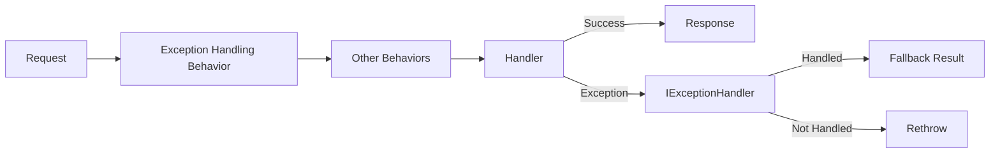

# Exception Handling

Cortex.Mediator provides built-in exception handling behaviors that allow you to centralize error management, log exceptions consistently, and optionally provide fallback results.

Exception handling in Cortex.Mediator works through pipeline behaviors that wrap your handlers:



## Setup

### Basic Setup

```csharp
builder.Services.AddCortexMediator(
    new[] { typeof(Program).Assembly },
    options => options.AddExceptionHandlingBehaviors()
);
```

### With Logging and Exception Handling

```csharp
builder.Services.AddCortexMediator(
    new[] { typeof(Program).Assembly },
    options => options.AddDefaultBehaviorsWithExceptionHandling()
);
```

### With All Behaviors

```csharp
builder.Services.AddCortexMediator(
    new[] { typeof(Program).Assembly },
    options => options.AddAllBehaviors()
);
```

## Built-in Exception Handling Behaviors

| Behavior | Description |
|----------|-------------|
| `ExceptionHandlingCommandBehavior<TCommand, TResult>` | Handles exceptions for commands with return values |
| `ExceptionHandlingVoidCommandBehavior<TCommand>` | Handles exceptions for void commands |
| `ExceptionHandlingQueryBehavior<TQuery, TResult>` | Handles exceptions for queries |
| `ExceptionHandlingNotificationBehavior<TNotification>` | Handles exceptions for notifications |

## The IExceptionHandler Interface

### Basic Exception Handler

```csharp
using Cortex.Mediator.Behaviors;

public interface IExceptionHandler
{
    /// <summary>
    /// Handles an exception that occurred during request processing.
    /// </summary>
    /// <param name="exception">The exception that was thrown.</param>
    /// <param name="requestType">The type of the request being processed.</param>
    /// <param name="request">The request object.</param>
    /// <param name="cancellationToken">Cancellation token.</param>
    /// <returns>True if the exception was handled and should be suppressed; false to rethrow.</returns>
    Task<bool> HandleAsync(
        Exception exception,
        Type requestType,
        object request,
        CancellationToken cancellationToken);
}
```

### Exception Handler with Fallback Results

```csharp
public interface IExceptionHandler<TResult> : IExceptionHandler
{
    /// <summary>
    /// Handles an exception and optionally provides a fallback result.
    /// </summary>
    /// <returns>A tuple indicating if handled and the fallback result.</returns>
    Task<(bool handled, TResult? result)> HandleWithResultAsync(
        Exception exception,
        Type requestType,
        object request,
        CancellationToken cancellationToken);
}
```

## Implementing Exception Handlers

### Simple Logging Handler

```csharp
public class LoggingExceptionHandler : IExceptionHandler
{
    private readonly ILogger<LoggingExceptionHandler> _logger;

    public LoggingExceptionHandler(ILogger<LoggingExceptionHandler> logger)
    {
        _logger = logger;
    }

    public Task<bool> HandleAsync(
        Exception exception,
        Type requestType,
        object request,
        CancellationToken cancellationToken)
    {
        _logger.LogError(
            exception,
            "Error processing {RequestType}: {Message}",
            requestType.Name,
            exception.Message);

        // Return false to rethrow the exception
        return Task.FromResult(false);
    }
}

// Register
builder.Services.AddSingleton<IExceptionHandler, LoggingExceptionHandler>();
```

### Handler with Fallback Result

```csharp
public class ApiResponseExceptionHandler : IExceptionHandler<ApiResponse>
{
    private readonly ILogger<ApiResponseExceptionHandler> _logger;

    public ApiResponseExceptionHandler(ILogger<ApiResponseExceptionHandler> logger)
    {
        _logger = logger;
    }

    public Task<(bool handled, ApiResponse? result)> HandleWithResultAsync(
        Exception exception,
        Type requestType,
        object request,
        CancellationToken cancellationToken)
    {
        _logger.LogError(exception, "Error processing {RequestType}", requestType.Name);

        // Return a fallback error response instead of throwing
        var fallbackResponse = new ApiResponse
        {
            Success = false,
            Error = GetUserFriendlyMessage(exception),
            ErrorCode = GetErrorCode(exception)
        };

        return Task.FromResult((true, fallbackResponse));
    }

    public Task<bool> HandleAsync(
        Exception exception,
        Type requestType,
        object request,
        CancellationToken cancellationToken)
    {
        // For non-generic handling, just log and rethrow
        _logger.LogError(exception, "Error processing {RequestType}", requestType.Name);
        return Task.FromResult(false);
    }

    private string GetUserFriendlyMessage(Exception exception)
    {
        return exception switch
        {
            ValidationException => "Invalid input data",
            NotFoundException => "The requested resource was not found",
            UnauthorizedAccessException => "You don't have permission to perform this action",
            _ => "An unexpected error occurred. Please try again later."
        };
    }

    private string GetErrorCode(Exception exception)
    {
        return exception switch
        {
            ValidationException => "VALIDATION_ERROR",
            NotFoundException => "NOT_FOUND",
            UnauthorizedAccessException => "UNAUTHORIZED",
            _ => "INTERNAL_ERROR"
        };
    }
}

// Result type
public class ApiResponse
{
    public bool Success { get; set; }
    public string Error { get; set; }
    public string ErrorCode { get; set; }
}

// Register for specific result type
builder.Services.AddSingleton<IExceptionHandler<ApiResponse>, ApiResponseExceptionHandler>();
```

### Domain-Specific Exception Handler

```csharp
public class OrderExceptionHandler : IExceptionHandler<OrderResult>
{
    private readonly ILogger<OrderExceptionHandler> _logger;
    private readonly INotificationService _notificationService;

    public OrderExceptionHandler(
        ILogger<OrderExceptionHandler> logger,
        INotificationService notificationService)
    {
        _logger = logger;
        _notificationService = notificationService;
    }

    public async Task<(bool handled, OrderResult? result)> HandleWithResultAsync(
        Exception exception,
        Type requestType,
        object request,
        CancellationToken cancellationToken)
    {
        _logger.LogError(exception, "Order processing error: {RequestType}", requestType.Name);

        // Handle specific exceptions
        if (exception is InsufficientInventoryException inventoryEx)
        {
            return (true, new OrderResult
            {
                Success = false,
                Error = $"Insufficient inventory for product: {inventoryEx.ProductName}",
                ErrorCode = "INSUFFICIENT_INVENTORY"
            });
        }

        if (exception is PaymentDeclinedException paymentEx)
        {
            // Notify support team
            await _notificationService.NotifySupportAsync(
                "Payment Declined",
                $"Payment declined for order. Reason: {paymentEx.Reason}",
                cancellationToken);

            return (true, new OrderResult
            {
                Success = false,
                Error = "Payment was declined. Please check your payment details.",
                ErrorCode = "PAYMENT_DECLINED"
            });
        }

        // Don't handle unknown exceptions - let them propagate
        return (false, null);
    }

    public Task<bool> HandleAsync(
        Exception exception,
        Type requestType,
        object request,
        CancellationToken cancellationToken)
    {
        _logger.LogError(exception, "Order error: {Message}", exception.Message);
        return Task.FromResult(false);
    }
}
```

## Real-World Examples

### Example 1: Comprehensive Exception Handler

```csharp
public class GlobalExceptionHandler : IExceptionHandler
{
    private readonly ILogger<GlobalExceptionHandler> _logger;
    private readonly IErrorTrackingService _errorTracking;
    private readonly ICurrentUserService _currentUser;

    public GlobalExceptionHandler(
        ILogger<GlobalExceptionHandler> logger,
        IErrorTrackingService errorTracking,
        ICurrentUserService currentUser)
    {
        _logger = logger;
        _errorTracking = errorTracking;
        _currentUser = currentUser;
    }

    public async Task<bool> HandleAsync(
        Exception exception,
        Type requestType,
        object request,
        CancellationToken cancellationToken)
    {
        var user = _currentUser.GetCurrentUser();
        var requestJson = JsonSerializer.Serialize(request);

        // Log structured error
        _logger.LogError(
            exception,
            "Unhandled exception in {RequestType}. User: {UserId}, Request: {Request}",
            requestType.Name,
            user?.Id,
            requestJson);

        // Track in error monitoring service (e.g., Sentry, Application Insights)
        await _errorTracking.CaptureExceptionAsync(exception, new Dictionary<string, object>
        {
            ["RequestType"] = requestType.Name,
            ["Request"] = requestJson,
            ["UserId"] = user?.Id?.ToString() ?? "anonymous",
            ["Timestamp"] = DateTime.UtcNow
        });

        // Determine if we should suppress the exception
        return ShouldSuppressException(exception);
    }

    private bool ShouldSuppressException(Exception exception)
    {
        // Only suppress specific, expected exceptions
        return exception switch
        {
            OperationCanceledException => true,  // User cancelled
            TaskCanceledException => true,        // Timeout
            _ => false
        };
    }
}
```

### Example 2: Circuit Breaker Pattern

```csharp
public class CircuitBreakerExceptionHandler : IExceptionHandler
{
    private readonly ILogger<CircuitBreakerExceptionHandler> _logger;
    private readonly ICircuitBreaker _circuitBreaker;

    public CircuitBreakerExceptionHandler(
        ILogger<CircuitBreakerExceptionHandler> logger,
        ICircuitBreaker circuitBreaker)
    {
        _logger = logger;
        _circuitBreaker = circuitBreaker;
    }

    public async Task<bool> HandleAsync(
        Exception exception,
        Type requestType,
        object request,
        CancellationToken cancellationToken)
    {
        // Track failures for circuit breaker
        if (IsTransientException(exception))
        {
            await _circuitBreaker.RecordFailureAsync(requestType.Name);

            if (_circuitBreaker.IsOpen(requestType.Name))
            {
                _logger.LogWarning(
                    "Circuit breaker is open for {RequestType}. Request blocked.",
                    requestType.Name);
            }
        }

        _logger.LogError(
            exception,
            "Exception in {RequestType}: {Message}",
            requestType.Name,
            exception.Message);

        return false; // Don't suppress - let the exception propagate
    }

    private bool IsTransientException(Exception exception)
    {
        return exception is TimeoutException
            || exception is HttpRequestException
            || exception.Message.Contains("connection");
    }
}

// Circuit breaker interface
public interface ICircuitBreaker
{
    Task RecordFailureAsync(string key);
    Task RecordSuccessAsync(string key);
    bool IsOpen(string key);
}
```

### Example 3: Notification Exception Suppression

```csharp
public class NotificationExceptionHandler : IExceptionHandler
{
    private readonly ILogger<NotificationExceptionHandler> _logger;
    private readonly IAlertService _alertService;

    public NotificationExceptionHandler(
        ILogger<NotificationExceptionHandler> logger,
        IAlertService alertService)
    {
        _logger = logger;
        _alertService = alertService;
    }

    public async Task<bool> HandleAsync(
        Exception exception,
        Type requestType,
        object request,
        CancellationToken cancellationToken)
    {
        _logger.LogError(
            exception,
            "Notification handler failed for {NotificationType}",
            requestType.Name);

        // For notifications, we might want to suppress exceptions
        // to allow other handlers to continue executing
        if (IsCriticalNotification(requestType))
        {
            // Alert operations team for critical notifications
            await _alertService.SendAlertAsync(
                "Critical Notification Failed",
                $"Notification type: {requestType.Name}\nError: {exception.Message}",
                AlertSeverity.High,
                cancellationToken);

            // Still rethrow for critical notifications
            return false;
        }

        // Suppress non-critical notification failures
        _logger.LogWarning(
            "Suppressing exception for non-critical notification {NotificationType}",
            requestType.Name);
        
        return true; // Suppress the exception
    }

    private bool IsCriticalNotification(Type notificationType)
    {
        // Define which notifications are critical
        var criticalNotifications = new[]
        {
            typeof(PaymentFailedNotification),
            typeof(SecurityAlertNotification),
            typeof(SystemErrorNotification)
        };

        return criticalNotifications.Contains(notificationType);
    }
}
```

### Example 4: Request-Specific Error Handling

```csharp
// Define marker interface for requests with custom error handling
public interface IHasCustomErrorHandling<TResult>
{
    TResult CreateErrorResult(Exception exception);
}

// Custom exception handler that uses the interface
public class CustomErrorResultHandler : IExceptionHandler
{
    private readonly ILogger<CustomErrorResultHandler> _logger;

    public CustomErrorResultHandler(ILogger<CustomErrorResultHandler> logger)
    {
        _logger = logger;
    }

    public Task<bool> HandleAsync(
        Exception exception,
        Type requestType,
        object request,
        CancellationToken cancellationToken)
    {
        _logger.LogError(exception, "Error in {RequestType}", requestType.Name);
        return Task.FromResult(false);
    }
}

// Extended handler for specific result types
public class CustomErrorResultHandler<TResult> : IExceptionHandler<TResult>
{
    private readonly ILogger<CustomErrorResultHandler<TResult>> _logger;

    public CustomErrorResultHandler(ILogger<CustomErrorResultHandler<TResult>> logger)
    {
        _logger = logger;
    }

    public Task<(bool handled, TResult? result)> HandleWithResultAsync(
        Exception exception,
        Type requestType,
        object request,
        CancellationToken cancellationToken)
    {
        // Check if request implements custom error handling
        if (request is IHasCustomErrorHandling<TResult> customHandler)
        {
            _logger.LogWarning(
                exception,
                "Using custom error result for {RequestType}",
                requestType.Name);

            var errorResult = customHandler.CreateErrorResult(exception);
            return Task.FromResult((true, errorResult));
        }

        // Default handling
        _logger.LogError(exception, "Error in {RequestType}", requestType.Name);
        return Task.FromResult<(bool, TResult?)>((false, default));
    }

    public Task<bool> HandleAsync(
        Exception exception,
        Type requestType,
        object request,
        CancellationToken cancellationToken)
    {
        _logger.LogError(exception, "Error in {RequestType}", requestType.Name);
        return Task.FromResult(false);
    }
}

// Usage
public class GetUserQuery : IQuery<UserResult>, IHasCustomErrorHandling<UserResult>
{
    public Guid UserId { get; set; }

    public UserResult CreateErrorResult(Exception exception)
    {
        return new UserResult
        {
            Success = false,
            Error = exception is NotFoundException 
                ? "User not found" 
                : "An error occurred while retrieving the user"
        };
    }
}
```

## Custom Exception Types

### Define Domain Exceptions

```csharp
// Base domain exception
public abstract class DomainException : Exception
{
    public string Code { get; }
    
    protected DomainException(string code, string message) : base(message)
    {
        Code = code;
    }
}

// Specific exceptions
public class NotFoundException : DomainException
{
    public NotFoundException(string entityName, object id) 
        : base("NOT_FOUND", $"{entityName} with id '{id}' was not found")
    {
    }
}

public class ValidationException : DomainException
{
    public IReadOnlyList<ValidationError> Errors { get; }

    public ValidationException(IEnumerable<ValidationError> errors)
        : base("VALIDATION_ERROR", "One or more validation errors occurred")
    {
        Errors = errors.ToList();
    }
}

public class ConflictException : DomainException
{
    public ConflictException(string message) 
        : base("CONFLICT", message)
    {
    }
}

public class ForbiddenException : DomainException
{
    public ForbiddenException(string message) 
        : base("FORBIDDEN", message)
    {
    }
}

public class BusinessRuleException : DomainException
{
    public BusinessRuleException(string code, string message) 
        : base(code, message)
    {
    }
}
```

### Handle Domain Exceptions

```csharp
public class DomainExceptionHandler : IExceptionHandler<Result>
{
    private readonly ILogger<DomainExceptionHandler> _logger;

    public DomainExceptionHandler(ILogger<DomainExceptionHandler> logger)
    {
        _logger = logger;
    }

    public Task<(bool handled, Result? result)> HandleWithResultAsync(
        Exception exception,
        Type requestType,
        object request,
        CancellationToken cancellationToken)
    {
        if (exception is DomainException domainException)
        {
            _logger.LogWarning(
                "Domain exception in {RequestType}: [{Code}] {Message}",
                requestType.Name,
                domainException.Code,
                domainException.Message);

            return Task.FromResult<(bool, Result?)>((true, Result.Failure(
                domainException.Code,
                domainException.Message)));
        }

        // For non-domain exceptions, log as error and don't handle
        _logger.LogError(
            exception,
            "Unexpected exception in {RequestType}",
            requestType.Name);

        return Task.FromResult<(bool, Result?)>((false, null));
    }

    public Task<bool> HandleAsync(
        Exception exception,
        Type requestType,
        object request,
        CancellationToken cancellationToken)
    {
        if (exception is DomainException)
        {
            _logger.LogWarning(exception, "Domain exception: {Message}", exception.Message);
            return Task.FromResult(false); // Still rethrow for void handlers
        }

        _logger.LogError(exception, "Unexpected exception in {RequestType}", requestType.Name);
        return Task.FromResult(false);
    }
}
```

## Integration with ASP.NET Core

### Global Exception Filter

```csharp
public class GlobalExceptionFilter : IExceptionFilter
{
    private readonly ILogger<GlobalExceptionFilter> _logger;

    public GlobalExceptionFilter(ILogger<GlobalExceptionFilter> logger)
    {
        _logger = logger;
    }

    public void OnException(ExceptionContext context)
    {
        var exception = context.Exception;

        _logger.LogError(exception, "Unhandled exception: {Message}", exception.Message);

        var response = exception switch
        {
            ValidationException validationEx => new ProblemDetails
            {
                Status = StatusCodes.Status400BadRequest,
                Title = "Validation Error",
                Detail = validationEx.Message,
                Extensions = { ["errors"] = validationEx.Errors }
            },
            NotFoundException => new ProblemDetails
            {
                Status = StatusCodes.Status404NotFound,
                Title = "Not Found",
                Detail = exception.Message
            },
            ForbiddenException => new ProblemDetails
            {
                Status = StatusCodes.Status403Forbidden,
                Title = "Forbidden",
                Detail = exception.Message
            },
            _ => new ProblemDetails
            {
                Status = StatusCodes.Status500InternalServerError,
                Title = "Internal Server Error",
                Detail = "An unexpected error occurred"
            }
        };

        context.Result = new ObjectResult(response)
        {
            StatusCode = response.Status
        };

        context.ExceptionHandled = true;
    }
}

// Register in Program.cs
builder.Services.AddControllers(options =>
{
    options.Filters.Add<GlobalExceptionFilter>();
});
```

## Best Practices

### ✅ DO

- **Log all exceptions** - Always log with appropriate level
- **Use structured logging** - Include request type, user, and context
- **Create domain exceptions** - Use meaningful exception types
- **Provide fallback results** - When appropriate for the use case
- **Track errors externally** - Use services like Sentry, Application Insights
- **Handle specific exceptions first** - More specific before generic
- **Consider user experience** - Return user-friendly messages

### ❌ DON'T

- **Don't swallow exceptions silently** - Always log before suppressing
- **Don't expose internal details** - Hide stack traces from users
- **Don't catch Exception blindly** - Be specific about what you handle
- **Don't forget async** - Exception handlers should be async
- **Don't suppress critical exceptions** - Some exceptions must propagate

## Testing Exception Handlers

```csharp
public class GlobalExceptionHandlerTests
{
    [Fact]
    public async Task HandleAsync_LogsException_ReturnsFalse()
    {
        // Arrange
        var mockLogger = new Mock<ILogger<GlobalExceptionHandler>>();
        var mockErrorTracking = new Mock<IErrorTrackingService>();
        var mockCurrentUser = new Mock<ICurrentUserService>();
        
        var handler = new GlobalExceptionHandler(
            mockLogger.Object,
            mockErrorTracking.Object,
            mockCurrentUser.Object);

        var exception = new InvalidOperationException("Test error");
        var request = new TestCommand();

        // Act
        var result = await handler.HandleAsync(
            exception,
            typeof(TestCommand),
            request,
            CancellationToken.None);

        // Assert
        Assert.False(result); // Exception should not be suppressed
        
        mockLogger.Verify(
            x => x.Log(
                LogLevel.Error,
                It.IsAny<EventId>(),
                It.IsAny<It.IsAnyType>(),
                exception,
                It.IsAny<Func<It.IsAnyType, Exception, string>>()),
            Times.Once);
    }

    [Fact]
    public async Task HandleWithResultAsync_DomainException_ReturnsFallback()
    {
        // Arrange
        var mockLogger = new Mock<ILogger<DomainExceptionHandler>>();
        var handler = new DomainExceptionHandler(mockLogger.Object);
        var exception = new NotFoundException("User", Guid.NewGuid());

        // Act
        var (handled, result) = await handler.HandleWithResultAsync(
            exception,
            typeof(GetUserQuery),
            new GetUserQuery(),
            CancellationToken.None);

        // Assert
        Assert.True(handled);
        Assert.NotNull(result);
        Assert.False(result.Success);
        Assert.Equal("NOT_FOUND", result.ErrorCode);
    }
}
```