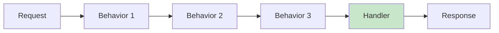
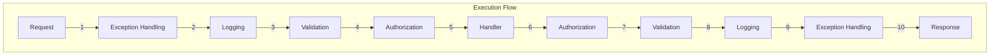

# Pipeline Behaviors

Pipeline behaviors are interceptors that wrap around your handlers, allowing you to add cross-cutting concerns like logging, validation, caching, and exception handling without modifying your handlers.

## What are Pipeline Behaviors?

Think of pipeline behaviors as middleware for your mediator requests. They form a chain around your handler, allowing you to:

- Execute code **before** the handler runs
- Execute code **after** the handler runs
- Modify the request or response
- Short-circuit the pipeline (skip the handler)
- Handle exceptions



## Built-in Behaviors

Cortex.Mediator includes several built-in behaviors:

| Behavior | Purpose | Request Type |
|----------|---------|--------------|
| `LoggingCommandBehavior` | Logs command execution with timing | Commands |
| `LoggingQueryBehavior` | Logs query execution with timing | Queries |
| `LoggingNotificationBehavior` | Logs notification publishing | Notifications |
| `LoggingStreamQueryBehavior` | Logs streaming query execution | Stream Queries |
| `ExceptionHandlingCommandBehavior` | Centralized exception handling | Commands |
| `ExceptionHandlingQueryBehavior` | Centralized exception handling | Queries |
| `ExceptionHandlingNotificationBehavior` | Centralized exception handling | Notifications |
| `CachingQueryBehavior` | Automatic query result caching | Queries |
| `RequestPreProcessorBehavior` | Runs pre-processors | Commands/Queries |
| `RequestPostProcessorBehavior` | Runs post-processors | Commands/Queries |
| `ValidationCommandBehavior` | FluentValidation support | Commands |

## Registering Behaviors

### Default Logging Behaviors

```csharp
builder.Services.AddCortexMediator(
    new[] { typeof(Program).Assembly },
    options => options.AddDefaultBehaviors()
);
```

### Exception Handling Behaviors

```csharp
builder.Services.AddCortexMediator(
    new[] { typeof(Program).Assembly },
    options => options.AddExceptionHandlingBehaviors()
);
```

### Caching Behavior

```csharp
builder.Services.AddMemoryCache();
builder.Services.AddMediatorCaching();

builder.Services.AddCortexMediator(
    new[] { typeof(Program).Assembly },
    options => options.AddCachingBehavior()
);
```

### All Behaviors

```csharp
builder.Services.AddCortexMediator(
    new[] { typeof(Program).Assembly },
    options => options.AddAllBehaviors()
);
```

### Custom Registration Order

```csharp
builder.Services.AddCortexMediator(
    new[] { typeof(Program).Assembly },
    options => options
        // Outermost (runs first/last)
        .AddOpenCommandPipelineBehavior(typeof(ExceptionHandlingCommandBehavior<,>))
        .AddOpenQueryPipelineBehavior(typeof(ExceptionHandlingQueryBehavior<,>))
        // Middle
        .AddOpenCommandPipelineBehavior(typeof(LoggingCommandBehavior<,>))
        .AddOpenQueryPipelineBehavior(typeof(LoggingQueryBehavior<,>))
        // Innermost (closest to handler)
        .AddOpenCommandPipelineBehavior(typeof(ValidationCommandBehavior<,>))
        .AddOpenQueryPipelineBehavior(typeof(CachingQueryBehavior<,>))
);
```

## Creating Custom Behaviors

### Command Pipeline Behavior

```csharp
using Cortex.Mediator.Commands;

public class TimingCommandBehavior<TCommand, TResult> 
    : ICommandPipelineBehavior<TCommand, TResult>
    where TCommand : ICommand<TResult>
{
    private readonly ILogger<TimingCommandBehavior<TCommand, TResult>> _logger;

    public TimingCommandBehavior(
        ILogger<TimingCommandBehavior<TCommand, TResult>> logger)
    {
        _logger = logger;
    }

    public async Task<TResult> Handle(
        TCommand command,
        CommandHandlerDelegate<TResult> next,
        CancellationToken cancellationToken)
    {
        var commandName = typeof(TCommand).Name;
        var stopwatch = Stopwatch.StartNew();

        _logger.LogInformation("Starting command {CommandName}", commandName);

        try
        {
            // Call the next behavior or handler in the pipeline
            var result = await next();

            stopwatch.Stop();
            _logger.LogInformation(
                "Completed command {CommandName} in {ElapsedMs}ms",
                commandName,
                stopwatch.ElapsedMilliseconds);

            return result;
        }
        catch (Exception ex)
        {
            stopwatch.Stop();
            _logger.LogError(
                ex,
                "Failed command {CommandName} after {ElapsedMs}ms",
                commandName,
                stopwatch.ElapsedMilliseconds);
            throw;
        }
    }
}
```

### Query Pipeline Behavior

```csharp
using Cortex.Mediator.Queries;

public class PerformanceQueryBehavior<TQuery, TResult> 
    : IQueryPipelineBehavior<TQuery, TResult>
    where TQuery : IQuery<TResult>
{
    private readonly ILogger<PerformanceQueryBehavior<TQuery, TResult>> _logger;
    private readonly IMetricsCollector _metrics;
    private const int SlowQueryThresholdMs = 500;

    public PerformanceQueryBehavior(
        ILogger<PerformanceQueryBehavior<TQuery, TResult>> logger,
        IMetricsCollector metrics)
    {
        _logger = logger;
        _metrics = metrics;
    }

    public async Task<TResult> Handle(
        TQuery query,
        QueryHandlerDelegate<TResult> next,
        CancellationToken cancellationToken)
    {
        var queryName = typeof(TQuery).Name;
        var stopwatch = Stopwatch.StartNew();

        var result = await next();

        stopwatch.Stop();
        var elapsedMs = stopwatch.ElapsedMilliseconds;

        // Record metrics
        _metrics.RecordQueryDuration(queryName, elapsedMs);

        // Log slow queries
        if (elapsedMs > SlowQueryThresholdMs)
        {
            _logger.LogWarning(
                "Slow query detected: {QueryName} took {ElapsedMs}ms",
                queryName,
                elapsedMs);
        }

        return result;
    }
}
```

### Notification Pipeline Behavior

```csharp
using Cortex.Mediator.Notifications;

public class NotificationLoggingBehavior<TNotification> 
    : INotificationPipelineBehavior<TNotification>
    where TNotification : INotification
{
    private readonly ILogger<NotificationLoggingBehavior<TNotification>> _logger;

    public NotificationLoggingBehavior(
        ILogger<NotificationLoggingBehavior<TNotification>> logger)
    {
        _logger = logger;
    }

    public async Task Handle(
        TNotification notification,
        NotificationHandlerDelegate next,
        CancellationToken cancellationToken)
    {
        var notificationName = typeof(TNotification).Name;

        _logger.LogInformation(
            "Publishing notification {NotificationName}: {@Notification}",
            notificationName,
            notification);

        await next();

        _logger.LogInformation(
            "Completed notification {NotificationName}",
            notificationName);
    }
}
```

### Stream Query Pipeline Behavior

```csharp
using Cortex.Mediator.Streaming;
using System.Runtime.CompilerServices;

public class StreamMetricsBehavior<TQuery, TResult> 
    : IStreamQueryPipelineBehavior<TQuery, TResult>
    where TQuery : IStreamQuery<TResult>
{
    private readonly ILogger<StreamMetricsBehavior<TQuery, TResult>> _logger;
    private readonly IMetricsCollector _metrics;

    public StreamMetricsBehavior(
        ILogger<StreamMetricsBehavior<TQuery, TResult>> logger,
        IMetricsCollector metrics)
    {
        _logger = logger;
        _metrics = metrics;
    }

    public async IAsyncEnumerable<TResult> Handle(
        TQuery query,
        StreamQueryHandlerDelegate<TResult> next,
        [EnumeratorCancellation] CancellationToken cancellationToken)
    {
        var queryName = typeof(TQuery).Name;
        var stopwatch = Stopwatch.StartNew();
        var itemCount = 0;

        _logger.LogInformation("Starting stream query {QueryName}", queryName);

        await foreach (var item in next().WithCancellation(cancellationToken))
        {
            itemCount++;
            yield return item;
        }

        stopwatch.Stop();

        _logger.LogInformation(
            "Completed stream query {QueryName}. Items: {ItemCount}, Duration: {ElapsedMs}ms",
            queryName,
            itemCount,
            stopwatch.ElapsedMilliseconds);

        _metrics.RecordStreamQuery(queryName, itemCount, stopwatch.ElapsedMilliseconds);
    }
}
```

## Real-World Behavior Examples

### Example 1: Authorization Behavior

```csharp
public interface IAuthorizedCommand
{
    string RequiredPermission { get; }
}

public class AuthorizationBehavior<TCommand, TResult> 
    : ICommandPipelineBehavior<TCommand, TResult>
    where TCommand : ICommand<TResult>
{
    private readonly ICurrentUserService _currentUserService;
    private readonly IAuthorizationService _authorizationService;

    public AuthorizationBehavior(
        ICurrentUserService currentUserService,
        IAuthorizationService authorizationService)
    {
        _currentUserService = currentUserService;
        _authorizationService = authorizationService;
    }

    public async Task<TResult> Handle(
        TCommand command,
        CommandHandlerDelegate<TResult> next,
        CancellationToken cancellationToken)
    {
        // Check if command requires authorization
        if (command is IAuthorizedCommand authorizedCommand)
        {
            var user = _currentUserService.GetCurrentUser();
            
            if (user == null)
            {
                throw new UnauthorizedAccessException("User is not authenticated");
            }

            var hasPermission = await _authorizationService.HasPermissionAsync(
                user.Id,
                authorizedCommand.RequiredPermission,
                cancellationToken);

            if (!hasPermission)
            {
                throw new ForbiddenException(
                    $"User lacks permission: {authorizedCommand.RequiredPermission}");
            }
        }

        return await next();
    }
}

// Usage
public class DeleteUserCommand : ICommand<Unit>, IAuthorizedCommand
{
    public Guid UserId { get; set; }
    public string RequiredPermission => "users.delete";
}
```

### Example 2: Audit Trail Behavior

```csharp
public interface IAuditableCommand
{
    string AuditAction { get; }
    string AuditEntityType { get; }
    string AuditEntityId { get; }
}

public class AuditBehavior<TCommand, TResult> 
    : ICommandPipelineBehavior<TCommand, TResult>
    where TCommand : ICommand<TResult>
{
    private readonly IAuditService _auditService;
    private readonly ICurrentUserService _currentUserService;
    private readonly ILogger<AuditBehavior<TCommand, TResult>> _logger;

    public AuditBehavior(
        IAuditService auditService,
        ICurrentUserService currentUserService,
        ILogger<AuditBehavior<TCommand, TResult>> logger)
    {
        _auditService = auditService;
        _currentUserService = currentUserService;
        _logger = logger;
    }

    public async Task<TResult> Handle(
        TCommand command,
        CommandHandlerDelegate<TResult> next,
        CancellationToken cancellationToken)
    {
        var result = await next();

        // Log audit trail for auditable commands
        if (command is IAuditableCommand auditableCommand)
        {
            try
            {
                var user = _currentUserService.GetCurrentUser();
                
                await _auditService.LogAsync(new AuditEntry
                {
                    UserId = user?.Id,
                    UserName = user?.Name ?? "Anonymous",
                    Action = auditableCommand.AuditAction,
                    EntityType = auditableCommand.AuditEntityType,
                    EntityId = auditableCommand.AuditEntityId,
                    Timestamp = DateTime.UtcNow,
                    Details = JsonSerializer.Serialize(command)
                }, cancellationToken);
            }
            catch (Exception ex)
            {
                // Don't fail the command if audit logging fails
                _logger.LogError(ex, "Failed to log audit entry");
            }
        }

        return result;
    }
}

// Usage
public class UpdateOrderCommand : ICommand<Unit>, IAuditableCommand
{
    public Guid OrderId { get; set; }
    public string Status { get; set; }
    
    public string AuditAction => "UpdateOrder";
    public string AuditEntityType => "Order";
    public string AuditEntityId => OrderId.ToString();
}
```

### Example 3: Retry Behavior

```csharp
public interface IRetryableCommand
{
    int MaxRetries { get; }
    TimeSpan RetryDelay { get; }
}

public class RetryBehavior<TCommand, TResult> 
    : ICommandPipelineBehavior<TCommand, TResult>
    where TCommand : ICommand<TResult>
{
    private readonly ILogger<RetryBehavior<TCommand, TResult>> _logger;

    public RetryBehavior(ILogger<RetryBehavior<TCommand, TResult>> logger)
    {
        _logger = logger;
    }

    public async Task<TResult> Handle(
        TCommand command,
        CommandHandlerDelegate<TResult> next,
        CancellationToken cancellationToken)
    {
        if (command is not IRetryableCommand retryable)
        {
            return await next();
        }

        var maxRetries = retryable.MaxRetries;
        var retryDelay = retryable.RetryDelay;
        var attempt = 0;

        while (true)
        {
            try
            {
                attempt++;
                return await next();
            }
            catch (Exception ex) when (attempt < maxRetries && IsTransientException(ex))
            {
                _logger.LogWarning(
                    ex,
                    "Command {CommandName} failed on attempt {Attempt}/{MaxRetries}. Retrying in {Delay}ms",
                    typeof(TCommand).Name,
                    attempt,
                    maxRetries,
                    retryDelay.TotalMilliseconds);

                await Task.Delay(retryDelay, cancellationToken);
            }
        }
    }

    private bool IsTransientException(Exception ex)
    {
        return ex is TimeoutException
            || ex is HttpRequestException
            || (ex is SqlException sqlEx && IsTransientSqlError(sqlEx));
    }

    private bool IsTransientSqlError(SqlException ex)
    {
        // SQL Server transient error codes
        int[] transientErrors = { -2, 20, 64, 233, 10053, 10054, 10060, 40197, 40501, 40613 };
        return transientErrors.Contains(ex.Number);
    }
}

// Usage
public class SendEmailCommand : ICommand<Unit>, IRetryableCommand
{
    public string To { get; set; }
    public string Subject { get; set; }
    public string Body { get; set; }
    
    public int MaxRetries => 3;
    public TimeSpan RetryDelay => TimeSpan.FromSeconds(2);
}
```

### Example 4: Transaction Behavior

```csharp
public interface ITransactionalCommand { }

public class TransactionBehavior<TCommand, TResult> 
    : ICommandPipelineBehavior<TCommand, TResult>
    where TCommand : ICommand<TResult>
{
    private readonly IUnitOfWork _unitOfWork;
    private readonly ILogger<TransactionBehavior<TCommand, TResult>> _logger;

    public TransactionBehavior(
        IUnitOfWork unitOfWork,
        ILogger<TransactionBehavior<TCommand, TResult>> logger)
    {
        _unitOfWork = unitOfWork;
        _logger = logger;
    }

    public async Task<TResult> Handle(
        TCommand command,
        CommandHandlerDelegate<TResult> next,
        CancellationToken cancellationToken)
    {
        if (command is not ITransactionalCommand)
        {
            return await next();
        }

        var commandName = typeof(TCommand).Name;
        
        _logger.LogInformation(
            "Beginning transaction for command {CommandName}",
            commandName);

        await using var transaction = await _unitOfWork.BeginTransactionAsync();

        try
        {
            var result = await next();
            
            await transaction.CommitAsync();
            
            _logger.LogInformation(
                "Committed transaction for command {CommandName}",
                commandName);

            return result;
        }
        catch (Exception ex)
        {
            _logger.LogError(
                ex,
                "Rolling back transaction for command {CommandName}",
                commandName);

            await transaction.RollbackAsync();
            throw;
        }
    }
}

// Usage
public class TransferFundsCommand : ICommand<TransferResult>, ITransactionalCommand
{
    public Guid FromAccountId { get; set; }
    public Guid ToAccountId { get; set; }
    public decimal Amount { get; set; }
}
```

### Example 5: Rate Limiting Behavior

```csharp
public interface IRateLimitedCommand
{
    string RateLimitKey { get; }
    int MaxRequestsPerMinute { get; }
}

public class RateLimitingBehavior<TCommand, TResult> 
    : ICommandPipelineBehavior<TCommand, TResult>
    where TCommand : ICommand<TResult>
{
    private readonly IRateLimiter _rateLimiter;
    private readonly ICurrentUserService _currentUserService;

    public RateLimitingBehavior(
        IRateLimiter rateLimiter,
        ICurrentUserService currentUserService)
    {
        _rateLimiter = rateLimiter;
        _currentUserService = currentUserService;
    }

    public async Task<TResult> Handle(
        TCommand command,
        CommandHandlerDelegate<TResult> next,
        CancellationToken cancellationToken)
    {
        if (command is not IRateLimitedCommand rateLimited)
        {
            return await next();
        }

        var user = _currentUserService.GetCurrentUser();
        var key = $"{rateLimited.RateLimitKey}:{user?.Id ?? "anonymous"}";

        var allowed = await _rateLimiter.TryAcquireAsync(
            key,
            rateLimited.MaxRequestsPerMinute,
            TimeSpan.FromMinutes(1),
            cancellationToken);

        if (!allowed)
        {
            throw new RateLimitExceededException(
                $"Rate limit exceeded for {typeof(TCommand).Name}. " +
                $"Maximum {rateLimited.MaxRequestsPerMinute} requests per minute.");
        }

        return await next();
    }
}

// Usage
public class SendSmsCommand : ICommand<Unit>, IRateLimitedCommand
{
    public string PhoneNumber { get; set; }
    public string Message { get; set; }
    
    public string RateLimitKey => "sms";
    public int MaxRequestsPerMinute => 10;
}
```

## Behavior Execution Order

Behaviors execute in the order they are registered. The first registered behavior is the outermost (executes first on the way in, last on the way out).

```csharp
// Registration order
options
    .AddOpenCommandPipelineBehavior(typeof(ExceptionHandlingBehavior<,>))  // 1st
    .AddOpenCommandPipelineBehavior(typeof(LoggingBehavior<,>))            // 2nd
    .AddOpenCommandPipelineBehavior(typeof(ValidationBehavior<,>))         // 3rd
    .AddOpenCommandPipelineBehavior(typeof(AuthorizationBehavior<,>));     // 4th

// Execution order:
// Request → Exception → Logging → Validation → Authorization → Handler
// Handler → Authorization → Validation → Logging → Exception → Response
```



## Best Practices

### ✅ DO

- **Keep behaviors focused** - One behavior, one responsibility
- **Use interfaces** - Define marker interfaces for behavior applicability
- **Handle exceptions properly** - Don't swallow exceptions unless intentional
- **Log appropriately** - Log at the right level (Info, Warning, Error)
- **Consider order** - Register behaviors in the correct order
- **Make behaviors reusable** - Design for generic use cases
- **Test behaviors** - Unit test each behavior independently

### ❌ DON'T

- **Don't modify the request** - Treat requests as immutable
- **Don't use behaviors for business logic** - Keep that in handlers
- **Don't create tight coupling** - Behaviors should be independent
- **Don't forget async** - Always use async/await properly
- **Don't ignore cancellation tokens** - Pass them through the pipeline

## Testing Behaviors

```csharp
public class LoggingBehaviorTests
{
    [Fact]
    public async Task Handle_SuccessfulCommand_LogsStartAndCompletion()
    {
        // Arrange
        var mockLogger = new Mock<ILogger<LoggingCommandBehavior<TestCommand, string>>>();
        var behavior = new LoggingCommandBehavior<TestCommand, string>(mockLogger.Object);
        var command = new TestCommand();

        // Act
        var result = await behavior.Handle(
            command,
            () => Task.FromResult("success"),
            CancellationToken.None);

        // Assert
        Assert.Equal("success", result);
        mockLogger.Verify(
            x => x.Log(
                LogLevel.Information,
                It.IsAny<EventId>(),
                It.Is<It.IsAnyType>((o, t) => o.ToString().Contains("Starting")),
                null,
                It.IsAny<Func<It.IsAnyType, Exception, string>>()),
            Times.Once);
    }

    [Fact]
    public async Task Handle_FailingCommand_LogsError()
    {
        // Arrange
        var mockLogger = new Mock<ILogger<LoggingCommandBehavior<TestCommand, string>>>();
        var behavior = new LoggingCommandBehavior<TestCommand, string>(mockLogger.Object);
        var command = new TestCommand();
        var expectedException = new InvalidOperationException("Test error");

        // Act & Assert
        await Assert.ThrowsAsync<InvalidOperationException>(() =>
            behavior.Handle(
                command,
                () => throw expectedException,
                CancellationToken.None));

        mockLogger.Verify(
            x => x.Log(
                LogLevel.Error,
                It.IsAny<EventId>(),
                It.IsAny<It.IsAnyType>(),
                expectedException,
                It.IsAny<Func<It.IsAnyType, Exception, string>>()),
            Times.Once);
    }
}
```
