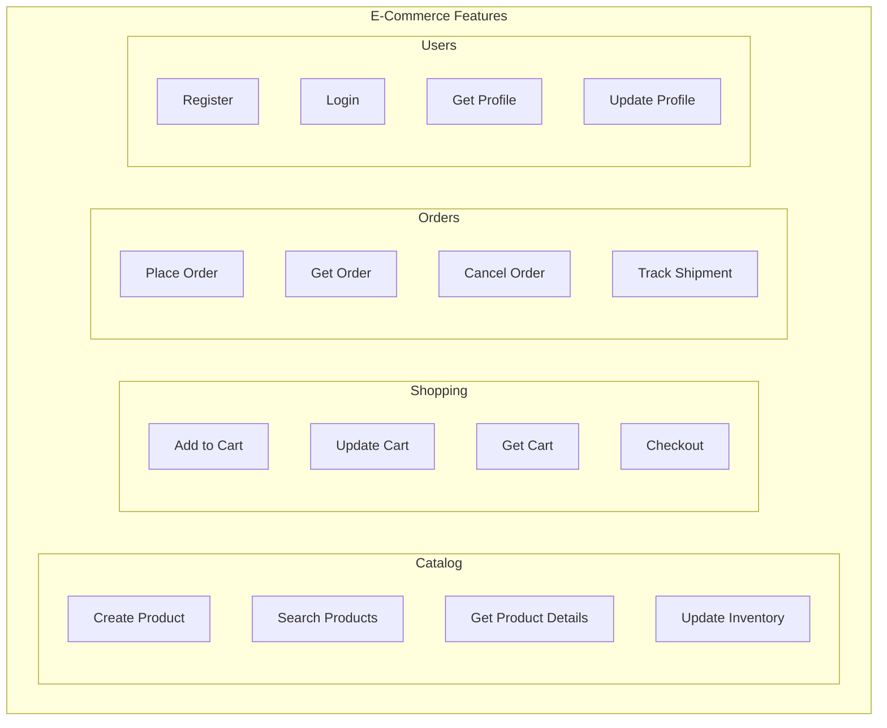

# E-Commerce Application Example

This comprehensive example demonstrates how to build a complete e-commerce application using Cortex.Mediator with Vertical Slice Architecture.

## Application Overview



## Project Structure

```
ECommerceApp/
├── src/
│   ├── ECommerceApp.Api/
│   │   ├── Features/
│   │   │   ├── Catalog/
│   │   │   │   ├── CreateProduct/
│   │   │   │   ├── SearchProducts/
│   │   │   │   ├── GetProductDetails/
│   │   │   │   ├── UpdateInventory/
│   │   │   │   ├── Events/
│   │   │   │   └── Shared/
│   │   │   ├── Shopping/
│   │   │   │   ├── AddToCart/
│   │   │   │   ├── UpdateCartItem/
│   │   │   │   ├── RemoveFromCart/
│   │   │   │   ├── GetCart/
│   │   │   │   └── Shared/
│   │   │   ├── Orders/
│   │   │   │   ├── PlaceOrder/
│   │   │   │   ├── GetOrder/
│   │   │   │   ├── ListOrders/
│   │   │   │   ├── CancelOrder/
│   │   │   │   ├── ShipOrder/
│   │   │   │   ├── Events/
│   │   │   │   └── Shared/
│   │   │   ├── Payments/
│   │   │   │   ├── ProcessPayment/
│   │   │   │   ├── RefundPayment/
│   │   │   │   └── Events/
│   │   │   └── Users/
│   │   │       ├── Register/
│   │   │       ├── Login/
│   │   │       ├── GetProfile/
│   │   │       └── UpdateProfile/
│   │   ├── Common/
│   │   │   ├── Behaviors/
│   │   │   ├── Exceptions/
│   │   │   ├── Extensions/
│   │   │   └── Models/
│   │   ├── Infrastructure/
│   │   │   ├── Data/
│   │   │   └── Services/
│   │   └── Program.cs
├── tests/
│   ├── ECommerceApp.UnitTests/
│   └── ECommerceApp.IntegrationTests/
```

## Domain Models

### Product

```csharp
namespace ECommerceApp.Api.Infrastructure.Data.Entities;

public class Product
{
    public Guid Id { get; set; }
    public string Sku { get; set; }
    public string Name { get; set; }
    public string Description { get; set; }
    public decimal Price { get; set; }
    public decimal? CompareAtPrice { get; set; }
    public string Category { get; set; }
    public int StockQuantity { get; set; }
    public bool IsActive { get; set; }
    public List<string> Tags { get; set; } = new();
    public List<ProductImage> Images { get; set; } = new();
    public DateTime CreatedAt { get; set; }
    public DateTime? UpdatedAt { get; set; }
}

public class ProductImage
{
    public Guid Id { get; set; }
    public string Url { get; set; }
    public string AltText { get; set; }
    public bool IsPrimary { get; set; }
}
```

### Order

```csharp
public class Order
{
    public Guid Id { get; set; }
    public string OrderNumber { get; set; }
    public Guid CustomerId { get; set; }
    public Customer Customer { get; set; }
    public List<OrderItem> Items { get; set; } = new();
    public decimal Subtotal { get; set; }
    public decimal Tax { get; set; }
    public decimal ShippingCost { get; set; }
    public decimal TotalAmount { get; set; }
    public OrderStatus Status { get; set; }
    public string ShippingAddress { get; set; }
    public string BillingAddress { get; set; }
    public string PaymentMethod { get; set; }
    public string TransactionId { get; set; }
    public DateTime CreatedAt { get; set; }
    public DateTime? PaidAt { get; set; }
    public DateTime? ShippedAt { get; set; }
    public DateTime? DeliveredAt { get; set; }
    public DateTime? CancelledAt { get; set; }
    public string CancellationReason { get; set; }
}

public class OrderItem
{
    public Guid Id { get; set; }
    public Guid OrderId { get; set; }
    public Guid ProductId { get; set; }
    public string ProductName { get; set; }
    public string ProductSku { get; set; }
    public int Quantity { get; set; }
    public decimal UnitPrice { get; set; }
    public decimal Total => Quantity * UnitPrice;
}

public enum OrderStatus
{
    Pending,
    PaymentFailed,
    Paid,
    Processing,
    Shipped,
    Delivered,
    Cancelled,
    Refunded
}
```

### Shopping Cart

```csharp
public class ShoppingCart
{
    public Guid Id { get; set; }
    public Guid? CustomerId { get; set; }
    public string SessionId { get; set; }
    public List<CartItem> Items { get; set; } = new();
    public DateTime CreatedAt { get; set; }
    public DateTime UpdatedAt { get; set; }
    public DateTime? ExpiresAt { get; set; }
    
    public decimal Subtotal => Items.Sum(i => i.Total);
}

public class CartItem
{
    public Guid Id { get; set; }
    public Guid CartId { get; set; }
    public Guid ProductId { get; set; }
    public Product Product { get; set; }
    public int Quantity { get; set; }
    public decimal UnitPrice { get; set; }
    public decimal Total => Quantity * UnitPrice;
}
```

## Feature Implementations

### 1. Search Products (Query with Caching)

```csharp
// Features/Catalog/SearchProducts/SearchProductsQuery.cs
namespace ECommerceApp.Api.Features.Catalog.SearchProducts;

[Cacheable(AbsoluteExpirationSeconds = 120)]
public class SearchProductsQuery : IQuery<PagedResult<ProductListDto>>, ICacheableQuery
{
    public string SearchTerm { get; init; }
    public string Category { get; init; }
    public decimal? MinPrice { get; init; }
    public decimal? MaxPrice { get; init; }
    public bool? InStock { get; init; }
    public string SortBy { get; init; } = "name";
    public bool SortDescending { get; init; }
    public int Page { get; init; } = 1;
    public int PageSize { get; init; } = 20;

    public string CacheKey => 
        $"products-search-{SearchTerm?.ToLower()}-{Category?.ToLower()}-" +
        $"{MinPrice}-{MaxPrice}-{InStock}-{SortBy}-{SortDescending}-{Page}-{PageSize}";

    public TimeSpan? AbsoluteExpiration => TimeSpan.FromMinutes(2);
    public TimeSpan? SlidingExpiration => TimeSpan.FromSeconds(30);
}

public class ProductListDto
{
    public Guid Id { get; init; }
    public string Name { get; init; }
    public string Sku { get; init; }
    public decimal Price { get; init; }
    public decimal? CompareAtPrice { get; init; }
    public string Category { get; init; }
    public bool InStock { get; init; }
    public string PrimaryImageUrl { get; init; }
    public decimal? DiscountPercentage => CompareAtPrice.HasValue 
        ? Math.Round((1 - Price / CompareAtPrice.Value) * 100, 0) 
        : null;
}

// Features/Catalog/SearchProducts/SearchProductsHandler.cs
public class SearchProductsHandler : IQueryHandler<SearchProductsQuery, PagedResult<ProductListDto>>
{
    private readonly ApplicationDbContext _context;
    private readonly ILogger<SearchProductsHandler> _logger;

    public SearchProductsHandler(
        ApplicationDbContext context,
        ILogger<SearchProductsHandler> logger)
    {
        _context = context;
        _logger = logger;
    }

    public async Task<PagedResult<ProductListDto>> Handle(
        SearchProductsQuery query,
        CancellationToken cancellationToken)
    {
        _logger.LogInformation(
            "Searching products: term={SearchTerm}, category={Category}",
            query.SearchTerm,
            query.Category);

        var productsQuery = _context.Products
            .AsNoTracking()
            .Where(p => p.IsActive);

        // Apply filters
        if (!string.IsNullOrEmpty(query.SearchTerm))
        {
            var term = query.SearchTerm.ToLower();
            productsQuery = productsQuery.Where(p =>
                p.Name.ToLower().Contains(term) ||
                p.Description.ToLower().Contains(term) ||
                p.Sku.ToLower().Contains(term));
        }

        if (!string.IsNullOrEmpty(query.Category))
        {
            productsQuery = productsQuery.Where(p => p.Category == query.Category);
        }

        if (query.MinPrice.HasValue)
        {
            productsQuery = productsQuery.Where(p => p.Price >= query.MinPrice.Value);
        }

        if (query.MaxPrice.HasValue)
        {
            productsQuery = productsQuery.Where(p => p.Price <= query.MaxPrice.Value);
        }

        if (query.InStock.HasValue)
        {
            productsQuery = productsQuery.Where(p => 
                query.InStock.Value ? p.StockQuantity > 0 : p.StockQuantity == 0);
        }

        // Apply sorting
        productsQuery = query.SortBy?.ToLower() switch
        {
            "price" => query.SortDescending 
                ? productsQuery.OrderByDescending(p => p.Price)
                : productsQuery.OrderBy(p => p.Price),
            "name" => query.SortDescending
                ? productsQuery.OrderByDescending(p => p.Name)
                : productsQuery.OrderBy(p => p.Name),
            "newest" => productsQuery.OrderByDescending(p => p.CreatedAt),
            _ => productsQuery.OrderBy(p => p.Name)
        };

        // Get total count
        var totalCount = await productsQuery.CountAsync(cancellationToken);

        // Apply pagination and project
        var products = await productsQuery
            .Skip((query.Page - 1) * query.PageSize)
            .Take(query.PageSize)
            .Select(p => new ProductListDto
            {
                Id = p.Id,
                Name = p.Name,
                Sku = p.Sku,
                Price = p.Price,
                CompareAtPrice = p.CompareAtPrice,
                Category = p.Category,
                InStock = p.StockQuantity > 0,
                PrimaryImageUrl = p.Images
                    .Where(i => i.IsPrimary)
                    .Select(i => i.Url)
                    .FirstOrDefault()
            })
            .ToListAsync(cancellationToken);

        return new PagedResult<ProductListDto>
        {
            Items = products,
            TotalCount = totalCount,
            Page = query.Page,
            PageSize = query.PageSize
        };
    }
}

// Features/Catalog/SearchProducts/SearchProductsEndpoint.cs
public static class SearchProductsEndpoint
{
    public static void MapSearchProductsEndpoint(this IEndpointRouteBuilder app)
    {
        app.MapGet("/api/products", async (
            [FromQuery] string searchTerm,
            [FromQuery] string category,
            [FromQuery] decimal? minPrice,
            [FromQuery] decimal? maxPrice,
            [FromQuery] bool? inStock,
            [FromQuery] string sortBy,
            [FromQuery] bool sortDescending,
            [FromQuery] int page,
            [FromQuery] int pageSize,
            IMediator mediator,
            CancellationToken cancellationToken) =>
        {
            var query = new SearchProductsQuery
            {
                SearchTerm = searchTerm,
                Category = category,
                MinPrice = minPrice,
                MaxPrice = maxPrice,
                InStock = inStock,
                SortBy = sortBy ?? "name",
                SortDescending = sortDescending,
                Page = page > 0 ? page : 1,
                PageSize = pageSize > 0 ? Math.Min(pageSize, 100) : 20
            };

            var result = await mediator.QueryAsync(query, cancellationToken);
            return Results.Ok(result);
        })
        .WithName("SearchProducts")
        .WithTags("Catalog")
        .Produces<PagedResult<ProductListDto>>();
    }
}
```

### 2. Add to Cart (Command with Validation)

```csharp
// Features/Shopping/AddToCart/AddToCartCommand.cs
namespace ECommerceApp.Api.Features.Shopping.AddToCart;

public class AddToCartCommand : ICommand<CartDto>
{
    public Guid? CustomerId { get; init; }
    public string SessionId { get; init; }
    public Guid ProductId { get; init; }
    public int Quantity { get; init; }
}

public class CartDto
{
    public Guid CartId { get; init; }
    public List<CartItemDto> Items { get; init; }
    public decimal Subtotal { get; init; }
    public int ItemCount { get; init; }
}

public class CartItemDto
{
    public Guid Id { get; init; }
    public Guid ProductId { get; init; }
    public string ProductName { get; init; }
    public string ProductImage { get; init; }
    public int Quantity { get; init; }
    public decimal UnitPrice { get; init; }
    public decimal Total { get; init; }
    public bool InStock { get; init; }
}

// Features/Shopping/AddToCart/AddToCartValidator.cs
public class AddToCartValidator : AbstractValidator<AddToCartCommand>
{
    public AddToCartValidator()
    {
        RuleFor(x => x.ProductId)
            .NotEmpty().WithMessage("Product is required");

        RuleFor(x => x.Quantity)
            .GreaterThan(0).WithMessage("Quantity must be greater than 0")
            .LessThanOrEqualTo(10).WithMessage("Cannot add more than 10 of the same item");

        RuleFor(x => x)
            .Must(x => x.CustomerId.HasValue || !string.IsNullOrEmpty(x.SessionId))
            .WithMessage("Either customer ID or session ID is required");
    }
}

// Features/Shopping/AddToCart/AddToCartHandler.cs
public class AddToCartHandler : ICommandHandler<AddToCartCommand, CartDto>
{
    private readonly ApplicationDbContext _context;
    private readonly ILogger<AddToCartHandler> _logger;

    public AddToCartHandler(
        ApplicationDbContext context,
        ILogger<AddToCartHandler> logger)
    {
        _context = context;
        _logger = logger;
    }

    public async Task<CartDto> Handle(
        AddToCartCommand command,
        CancellationToken cancellationToken)
    {
        // Get or create cart
        var cart = await GetOrCreateCartAsync(command, cancellationToken);

        // Get product
        var product = await _context.Products
            .FirstOrDefaultAsync(p => p.Id == command.ProductId, cancellationToken);

        if (product == null)
        {
            throw new NotFoundException("Product", command.ProductId);
        }

        if (!product.IsActive)
        {
            throw new BusinessException("PRODUCT_UNAVAILABLE", "This product is no longer available");
        }

        if (product.StockQuantity < command.Quantity)
        {
            throw new BusinessException("INSUFFICIENT_STOCK", 
                $"Only {product.StockQuantity} items available in stock");
        }

        // Check if item already in cart
        var existingItem = cart.Items.FirstOrDefault(i => i.ProductId == command.ProductId);

        if (existingItem != null)
        {
            var newQuantity = existingItem.Quantity + command.Quantity;
            
            if (newQuantity > 10)
            {
                throw new BusinessException("MAX_QUANTITY_EXCEEDED", 
                    "Cannot have more than 10 of the same item in cart");
            }

            if (newQuantity > product.StockQuantity)
            {
                throw new BusinessException("INSUFFICIENT_STOCK", 
                    $"Only {product.StockQuantity} items available in stock");
            }

            existingItem.Quantity = newQuantity;
            existingItem.UnitPrice = product.Price; // Update price
        }
        else
        {
            cart.Items.Add(new CartItem
            {
                Id = Guid.NewGuid(),
                CartId = cart.Id,
                ProductId = product.Id,
                Quantity = command.Quantity,
                UnitPrice = product.Price
            });
        }

        cart.UpdatedAt = DateTime.UtcNow;
        await _context.SaveChangesAsync(cancellationToken);

        _logger.LogInformation(
            "Added {Quantity} x {ProductName} to cart {CartId}",
            command.Quantity,
            product.Name,
            cart.Id);

        return await MapToDto(cart, cancellationToken);
    }

    private async Task<ShoppingCart> GetOrCreateCartAsync(
        AddToCartCommand command, 
        CancellationToken cancellationToken)
    {
        ShoppingCart cart;

        if (command.CustomerId.HasValue)
        {
            cart = await _context.ShoppingCarts
                .Include(c => c.Items)
                .FirstOrDefaultAsync(c => c.CustomerId == command.CustomerId, cancellationToken);
        }
        else
        {
            cart = await _context.ShoppingCarts
                .Include(c => c.Items)
                .FirstOrDefaultAsync(c => c.SessionId == command.SessionId, cancellationToken);
        }

        if (cart == null)
        {
            cart = new ShoppingCart
            {
                Id = Guid.NewGuid(),
                CustomerId = command.CustomerId,
                SessionId = command.SessionId,
                CreatedAt = DateTime.UtcNow,
                UpdatedAt = DateTime.UtcNow,
                ExpiresAt = DateTime.UtcNow.AddDays(7)
            };
            _context.ShoppingCarts.Add(cart);
        }

        return cart;
    }

    private async Task<CartDto> MapToDto(ShoppingCart cart, CancellationToken cancellationToken)
    {
        var productIds = cart.Items.Select(i => i.ProductId).ToList();
        var products = await _context.Products
            .Where(p => productIds.Contains(p.Id))
            .Include(p => p.Images)
            .ToDictionaryAsync(p => p.Id, cancellationToken);

        return new CartDto
        {
            CartId = cart.Id,
            Items = cart.Items.Select(i =>
            {
                var product = products.GetValueOrDefault(i.ProductId);
                return new CartItemDto
                {
                    Id = i.Id,
                    ProductId = i.ProductId,
                    ProductName = product?.Name ?? "Unknown Product",
                    ProductImage = product?.Images.FirstOrDefault(img => img.IsPrimary)?.Url,
                    Quantity = i.Quantity,
                    UnitPrice = i.UnitPrice,
                    Total = i.Total,
                    InStock = product?.StockQuantity >= i.Quantity
                };
            }).ToList(),
            Subtotal = cart.Subtotal,
            ItemCount = cart.Items.Sum(i => i.Quantity)
        };
    }
}
```

### 3. Place Order (Command with Transaction)

```csharp
// Features/Orders/PlaceOrder/PlaceOrderCommand.cs
namespace ECommerceApp.Api.Features.Orders.PlaceOrder;

public class PlaceOrderCommand : ICommand<PlaceOrderResponse>, ITransactionalCommand
{
    public Guid CustomerId { get; init; }
    public Guid CartId { get; init; }
    public AddressDto ShippingAddress { get; init; }
    public AddressDto BillingAddress { get; init; }
    public PaymentInfoDto Payment { get; init; }
}

public class AddressDto
{
    public string FullName { get; init; }
    public string Line1 { get; init; }
    public string Line2 { get; init; }
    public string City { get; init; }
    public string State { get; init; }
    public string PostalCode { get; init; }
    public string Country { get; init; }
    public string Phone { get; init; }
}

public class PaymentInfoDto
{
    public string Method { get; init; } // "card", "paypal", etc.
    public string CardToken { get; init; }
}

public class PlaceOrderResponse
{
    public Guid OrderId { get; init; }
    public string OrderNumber { get; init; }
    public decimal TotalAmount { get; init; }
    public string Status { get; init; }
    public string PaymentStatus { get; init; }
}

// Features/Orders/PlaceOrder/PlaceOrderValidator.cs
public class PlaceOrderValidator : AbstractValidator<PlaceOrderCommand>
{
    public PlaceOrderValidator()
    {
        RuleFor(x => x.CustomerId).NotEmpty();
        RuleFor(x => x.CartId).NotEmpty();

        RuleFor(x => x.ShippingAddress).NotNull().SetValidator(new AddressValidator());
        RuleFor(x => x.BillingAddress).NotNull().SetValidator(new AddressValidator());

        RuleFor(x => x.Payment).NotNull();
        RuleFor(x => x.Payment.Method).NotEmpty().When(x => x.Payment != null);
        RuleFor(x => x.Payment.CardToken)
            .NotEmpty()
            .When(x => x.Payment?.Method == "card")
            .WithMessage("Card token is required for card payments");
    }
}

public class AddressValidator : AbstractValidator<AddressDto>
{
    public AddressValidator()
    {
        RuleFor(x => x.FullName).NotEmpty().MaximumLength(100);
        RuleFor(x => x.Line1).NotEmpty().MaximumLength(200);
        RuleFor(x => x.City).NotEmpty().MaximumLength(100);
        RuleFor(x => x.State).NotEmpty().MaximumLength(50);
        RuleFor(x => x.PostalCode).NotEmpty().MaximumLength(20);
        RuleFor(x => x.Country).NotEmpty().MaximumLength(50);
        RuleFor(x => x.Phone).NotEmpty().Matches(@"^\+?[\d\s\-]+$");
    }
}

// Features/Orders/PlaceOrder/PlaceOrderHandler.cs
public class PlaceOrderHandler : ICommandHandler<PlaceOrderCommand, PlaceOrderResponse>
{
    private readonly ApplicationDbContext _context;
    private readonly IPaymentService _paymentService;
    private readonly IMediator _mediator;
    private readonly ILogger<PlaceOrderHandler> _logger;

    public PlaceOrderHandler(
        ApplicationDbContext context,
        IPaymentService paymentService,
        IMediator mediator,
        ILogger<PlaceOrderHandler> logger)
    {
        _context = context;
        _paymentService = paymentService;
        _mediator = mediator;
        _logger = logger;
    }

    public async Task<PlaceOrderResponse> Handle(
        PlaceOrderCommand command,
        CancellationToken cancellationToken)
    {
        _logger.LogInformation(
            "Processing order for customer {CustomerId}",
            command.CustomerId);

        // Get cart with items
        var cart = await _context.ShoppingCarts
            .Include(c => c.Items)
            .FirstOrDefaultAsync(c => c.Id == command.CartId, cancellationToken);

        if (cart == null || !cart.Items.Any())
        {
            throw new BusinessException("EMPTY_CART", "Cart is empty or not found");
        }

        // Validate stock availability
        var productIds = cart.Items.Select(i => i.ProductId).ToList();
        var products = await _context.Products
            .Where(p => productIds.Contains(p.Id))
            .ToDictionaryAsync(p => p.Id, cancellationToken);

        foreach (var item in cart.Items)
        {
            var product = products.GetValueOrDefault(item.ProductId);
            if (product == null || !product.IsActive)
            {
                throw new BusinessException("PRODUCT_UNAVAILABLE", 
                    $"Product is no longer available");
            }
            if (product.StockQuantity < item.Quantity)
            {
                throw new BusinessException("INSUFFICIENT_STOCK", 
                    $"Insufficient stock for {product.Name}");
            }
        }

        // Calculate totals
        var subtotal = cart.Items.Sum(i => i.Total);
        var tax = subtotal * 0.08m; // 8% tax
        var shipping = subtotal >= 100 ? 0 : 9.99m; // Free shipping over $100
        var total = subtotal + tax + shipping;

        // Create order
        var order = new Order
        {
            Id = Guid.NewGuid(),
            OrderNumber = GenerateOrderNumber(),
            CustomerId = command.CustomerId,
            Subtotal = subtotal,
            Tax = tax,
            ShippingCost = shipping,
            TotalAmount = total,
            Status = OrderStatus.Pending,
            ShippingAddress = FormatAddress(command.ShippingAddress),
            BillingAddress = FormatAddress(command.BillingAddress),
            PaymentMethod = command.Payment.Method,
            CreatedAt = DateTime.UtcNow
        };

        // Add order items
        foreach (var cartItem in cart.Items)
        {
            var product = products[cartItem.ProductId];
            order.Items.Add(new OrderItem
            {
                Id = Guid.NewGuid(),
                OrderId = order.Id,
                ProductId = cartItem.ProductId,
                ProductName = product.Name,
                ProductSku = product.Sku,
                Quantity = cartItem.Quantity,
                UnitPrice = cartItem.UnitPrice
            });
        }

        _context.Orders.Add(order);

        // Process payment
        var paymentResult = await _paymentService.ProcessPaymentAsync(
            command.Payment.CardToken,
            total,
            order.OrderNumber,
            cancellationToken);

        if (paymentResult.Success)
        {
            order.Status = OrderStatus.Paid;
            order.TransactionId = paymentResult.TransactionId;
            order.PaidAt = DateTime.UtcNow;

            // Reserve inventory
            foreach (var item in cart.Items)
            {
                products[item.ProductId].StockQuantity -= item.Quantity;
            }

            // Clear cart
            _context.ShoppingCarts.Remove(cart);
        }
        else
        {
            order.Status = OrderStatus.PaymentFailed;
            _logger.LogWarning(
                "Payment failed for order {OrderNumber}: {Error}",
                order.OrderNumber,
                paymentResult.ErrorMessage);
        }

        await _context.SaveChangesAsync(cancellationToken);

        // Publish events
        if (order.Status == OrderStatus.Paid)
        {
            await _mediator.PublishAsync(new OrderPlacedNotification
            {
                OrderId = order.Id,
                OrderNumber = order.OrderNumber,
                CustomerId = order.CustomerId,
                TotalAmount = order.TotalAmount,
                Items = order.Items.Select(i => new OrderItemInfo
                {
                    ProductId = i.ProductId,
                    ProductName = i.ProductName,
                    Quantity = i.Quantity,
                    UnitPrice = i.UnitPrice
                }).ToList()
            }, cancellationToken);
        }

        _logger.LogInformation(
            "Order {OrderNumber} created with status {Status}",
            order.OrderNumber,
            order.Status);

        return new PlaceOrderResponse
        {
            OrderId = order.Id,
            OrderNumber = order.OrderNumber,
            TotalAmount = order.TotalAmount,
            Status = order.Status.ToString(),
            PaymentStatus = paymentResult.Success ? "Paid" : "Failed"
        };
    }

    private string GenerateOrderNumber()
    {
        return $"ORD-{DateTime.UtcNow:yyyyMMdd}-{Guid.NewGuid().ToString()[..8].ToUpper()}";
    }

    private string FormatAddress(AddressDto address)
    {
        return $"{address.FullName}\n{address.Line1}\n" +
               $"{(string.IsNullOrEmpty(address.Line2) ? "" : address.Line2 + "\n")}" +
               $"{address.City}, {address.State} {address.PostalCode}\n" +
               $"{address.Country}\n{address.Phone}";
    }
}
```

### 4. Order Placed Notification Handlers

```csharp
// Features/Orders/Events/OrderPlacedNotification.cs
namespace ECommerceApp.Api.Features.Orders.Events;

public class OrderPlacedNotification : INotification
{
    public Guid OrderId { get; init; }
    public string OrderNumber { get; init; }
    public Guid CustomerId { get; init; }
    public decimal TotalAmount { get; init; }
    public List<OrderItemInfo> Items { get; init; }
}

public class OrderItemInfo
{
    public Guid ProductId { get; init; }
    public string ProductName { get; init; }
    public int Quantity { get; init; }
    public decimal UnitPrice { get; init; }
}

// Handler 1: Send confirmation email
public class SendOrderConfirmationHandler : INotificationHandler<OrderPlacedNotification>
{
    private readonly IEmailService _emailService;
    private readonly ApplicationDbContext _context;
    private readonly ILogger<SendOrderConfirmationHandler> _logger;

    public SendOrderConfirmationHandler(
        IEmailService emailService,
        ApplicationDbContext context,
        ILogger<SendOrderConfirmationHandler> logger)
    {
        _emailService = emailService;
        _context = context;
        _logger = logger;
    }

    public async Task Handle(
        OrderPlacedNotification notification,
        CancellationToken cancellationToken)
    {
        var customer = await _context.Customers
            .FirstOrDefaultAsync(c => c.Id == notification.CustomerId, cancellationToken);

        if (customer == null) return;

        var emailContent = BuildOrderConfirmationEmail(notification);

        await _emailService.SendEmailAsync(
            customer.Email,
            $"Order Confirmation - {notification.OrderNumber}",
            emailContent,
            cancellationToken);

        _logger.LogInformation(
            "Order confirmation email sent for {OrderNumber}",
            notification.OrderNumber);
    }

    private string BuildOrderConfirmationEmail(OrderPlacedNotification notification)
    {
        var itemsHtml = string.Join("", notification.Items.Select(i =>
            $"<tr><td>{i.ProductName}</td><td>{i.Quantity}</td><td>${i.UnitPrice:F2}</td></tr>"));

        return $@"
            <h1>Thank you for your order!</h1>
            <p>Order Number: <strong>{notification.OrderNumber}</strong></p>
            <table>
                <thead><tr><th>Product</th><th>Qty</th><th>Price</th></tr></thead>
                <tbody>{itemsHtml}</tbody>
            </table>
            <p><strong>Total: ${notification.TotalAmount:F2}</strong></p>
        ";
    }
}

// Handler 2: Update inventory analytics
public class UpdateInventoryAnalyticsHandler : INotificationHandler<OrderPlacedNotification>
{
    private readonly IAnalyticsService _analyticsService;

    public UpdateInventoryAnalyticsHandler(IAnalyticsService analyticsService)
    {
        _analyticsService = analyticsService;
    }

    public async Task Handle(
        OrderPlacedNotification notification,
        CancellationToken cancellationToken)
    {
        foreach (var item in notification.Items)
        {
            await _analyticsService.RecordSaleAsync(
                item.ProductId,
                item.Quantity,
                item.UnitPrice * item.Quantity,
                cancellationToken);
        }
    }
}

// Handler 3: Send to fulfillment system
public class SendToFulfillmentHandler : INotificationHandler<OrderPlacedNotification>
{
    private readonly IFulfillmentService _fulfillmentService;
    private readonly ILogger<SendToFulfillmentHandler> _logger;

    public SendToFulfillmentHandler(
        IFulfillmentService fulfillmentService,
        ILogger<SendToFulfillmentHandler> logger)
    {
        _fulfillmentService = fulfillmentService;
        _logger = logger;
    }

    public async Task Handle(
        OrderPlacedNotification notification,
        CancellationToken cancellationToken)
    {
        try
        {
            await _fulfillmentService.CreateFulfillmentRequestAsync(
                notification.OrderId,
                notification.Items.Select(i => new FulfillmentItem
                {
                    ProductId = i.ProductId,
                    Quantity = i.Quantity
                }).ToList(),
                cancellationToken);

            _logger.LogInformation(
                "Fulfillment request created for order {OrderNumber}",
                notification.OrderNumber);
        }
        catch (Exception ex)
        {
            _logger.LogError(ex,
                "Failed to create fulfillment request for order {OrderNumber}",
                notification.OrderNumber);
            // Don't rethrow - we don't want to fail the order
        }
    }
}
```

### 5. Stream Orders Export

```csharp
// Features/Orders/ExportOrders/ExportOrdersQuery.cs
namespace ECommerceApp.Api.Features.Orders.ExportOrders;

public class ExportOrdersQuery : IStreamQuery<OrderExportDto>
{
    public DateTime StartDate { get; init; }
    public DateTime EndDate { get; init; }
    public string Status { get; init; }
}

public class OrderExportDto
{
    public string OrderNumber { get; init; }
    public string CustomerEmail { get; init; }
    public string CustomerName { get; init; }
    public decimal TotalAmount { get; init; }
    public string Status { get; init; }
    public DateTime CreatedAt { get; init; }
    public DateTime? ShippedAt { get; init; }
}

// Features/Orders/ExportOrders/ExportOrdersHandler.cs
public class ExportOrdersHandler : IStreamQueryHandler<ExportOrdersQuery, OrderExportDto>
{
    private readonly ApplicationDbContext _context;
    private readonly ILogger<ExportOrdersHandler> _logger;

    public ExportOrdersHandler(
        ApplicationDbContext context,
        ILogger<ExportOrdersHandler> logger)
    {
        _context = context;
        _logger = logger;
    }

    public async IAsyncEnumerable<OrderExportDto> Handle(
        ExportOrdersQuery query,
        [EnumeratorCancellation] CancellationToken cancellationToken)
    {
        _logger.LogInformation(
            "Starting order export from {StartDate} to {EndDate}",
            query.StartDate,
            query.EndDate);

        var ordersQuery = _context.Orders
            .AsNoTracking()
            .Include(o => o.Customer)
            .Where(o => o.CreatedAt >= query.StartDate && o.CreatedAt <= query.EndDate);

        if (!string.IsNullOrEmpty(query.Status))
        {
            var status = Enum.Parse<OrderStatus>(query.Status, ignoreCase: true);
            ordersQuery = ordersQuery.Where(o => o.Status == status);
        }

        ordersQuery = ordersQuery.OrderBy(o => o.CreatedAt);

        await foreach (var order in ordersQuery.AsAsyncEnumerable().WithCancellation(cancellationToken))
        {
            yield return new OrderExportDto
            {
                OrderNumber = order.OrderNumber,
                CustomerEmail = order.Customer.Email,
                CustomerName = order.Customer.FullName,
                TotalAmount = order.TotalAmount,
                Status = order.Status.ToString(),
                CreatedAt = order.CreatedAt,
                ShippedAt = order.ShippedAt
            };
        }

        _logger.LogInformation("Order export completed");
    }
}
```

## Program.cs Configuration

```csharp
using Cortex.Mediator.DependencyInjection;
using FluentValidation;

var builder = WebApplication.CreateBuilder(args);

// Add services
builder.Services.AddDbContext<ApplicationDbContext>(options =>
    options.UseSqlServer(builder.Configuration.GetConnectionString("DefaultConnection")));

// Add memory cache
builder.Services.AddMemoryCache();

// Add mediator caching
builder.Services.AddMediatorCaching(options =>
{
    options.DefaultAbsoluteExpiration = TimeSpan.FromMinutes(5);
    options.DefaultSlidingExpiration = TimeSpan.FromMinutes(1);
    options.CacheKeyPrefix = "ECommerce";
});

// Add validators
builder.Services.AddValidatorsFromAssembly(typeof(Program).Assembly);

// Add Cortex.Mediator with all behaviors
builder.Services.AddCortexMediator(
    new[] { typeof(Program).Assembly },
    options => options
        .AddDefaultBehaviorsWithExceptionHandling()
        .AddCachingBehavior()
        .AddProcessorBehaviors()
);

// Add application services
builder.Services.AddScoped<IPaymentService, StripePaymentService>();
builder.Services.AddScoped<IEmailService, SendGridEmailService>();
builder.Services.AddScoped<IFulfillmentService, FulfillmentService>();
builder.Services.AddScoped<IAnalyticsService, AnalyticsService>();

// Add authentication & authorization
builder.Services.AddAuthentication();
builder.Services.AddAuthorization();

var app = builder.Build();

// Middleware
app.UseAuthentication();
app.UseAuthorization();

// Map endpoints
app.MapCatalogEndpoints();
app.MapShoppingEndpoints();
app.MapOrderEndpoints();
app.MapUserEndpoints();

app.Run();
```

## Summary

This e-commerce example demonstrates:

1. **Vertical Slice Architecture** - Each feature is self-contained
2. **CQRS Pattern** - Commands for writes, Queries for reads
3. **Caching** - Product search results are cached
4. **Validation** - FluentValidation for all commands
5. **Notifications** - Event-driven order processing
6. **Streaming** - Efficient order export for large datasets
7. **Exception Handling** - Business exceptions with meaningful messages
8. **Transactions** - Order placement uses transactional behavior
