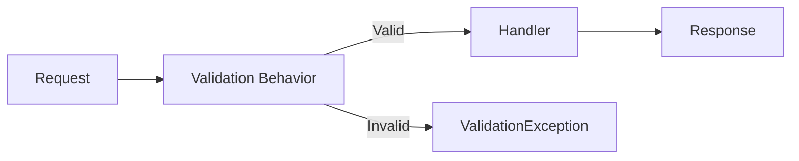

# FluentValidation Integration

Cortex.Mediator integrates seamlessly with [FluentValidation](https://docs.fluentvalidation.net/) to provide automatic request validation before handlers execute.

FluentValidation integration automatically validates commands and queries using your validators, throwing a `ValidationException` if validation fails.



## Setup

### 1. Install Packages

```bash
dotnet add package Cortex.Mediator.Behaviors.FluentValidation
dotnet add package FluentValidation
dotnet add package FluentValidation.DependencyInjectionExtensions
```

### 2. Register Services

```csharp
using Cortex.Mediator.DependencyInjection;
using FluentValidation;

var builder = WebApplication.CreateBuilder(args);

// Register all validators from assembly
builder.Services.AddValidatorsFromAssembly(typeof(Program).Assembly);

// Register mediator with validation
builder.Services.AddCortexMediator(
    new[] { typeof(Program).Assembly },
    options => options
        .AddDefaultBehaviors()
        .AddOpenCommandPipelineBehavior(typeof(ValidationCommandBehavior<,>))
);
```

## Creating Validators

### Basic Validator

```csharp
using FluentValidation;

public class CreateUserCommand : ICommand<Guid>
{
    public string Email { get; set; }
    public string Password { get; set; }
    public string FirstName { get; set; }
    public string LastName { get; set; }
}

public class CreateUserCommandValidator : AbstractValidator<CreateUserCommand>
{
    public CreateUserCommandValidator()
    {
        RuleFor(x => x.Email)
            .NotEmpty().WithMessage("Email is required")
            .EmailAddress().WithMessage("Invalid email format");

        RuleFor(x => x.Password)
            .NotEmpty().WithMessage("Password is required")
            .MinimumLength(8).WithMessage("Password must be at least 8 characters")
            .Matches("[A-Z]").WithMessage("Password must contain uppercase letter")
            .Matches("[a-z]").WithMessage("Password must contain lowercase letter")
            .Matches("[0-9]").WithMessage("Password must contain a number");

        RuleFor(x => x.FirstName)
            .NotEmpty().WithMessage("First name is required")
            .MaximumLength(50).WithMessage("First name cannot exceed 50 characters");

        RuleFor(x => x.LastName)
            .NotEmpty().WithMessage("Last name is required")
            .MaximumLength(50).WithMessage("Last name cannot exceed 50 characters");
    }
}
```

### Validator with Async Rules

```csharp
public class CreateUserCommandValidator : AbstractValidator<CreateUserCommand>
{
    private readonly IUserRepository _userRepository;

    public CreateUserCommandValidator(IUserRepository userRepository)
    {
        _userRepository = userRepository;

        RuleFor(x => x.Email)
            .NotEmpty()
            .EmailAddress()
            .MustAsync(BeUniqueEmail).WithMessage("Email is already registered");

        RuleFor(x => x.Password)
            .NotEmpty()
            .MinimumLength(8);
    }

    private async Task<bool> BeUniqueEmail(string email, CancellationToken cancellationToken)
    {
        var existingUser = await _userRepository.FindByEmailAsync(email, cancellationToken);
        return existingUser == null;
    }
}
```

### Validator with Complex Rules

```csharp
public class CreateOrderCommand : ICommand<Guid>
{
    public Guid CustomerId { get; set; }
    public List<OrderItemDto> Items { get; set; }
    public string ShippingAddress { get; set; }
    public string BillingAddress { get; set; }
    public bool SameAsBilling { get; set; }
}

public class OrderItemDto
{
    public Guid ProductId { get; set; }
    public int Quantity { get; set; }
    public decimal UnitPrice { get; set; }
}

public class CreateOrderCommandValidator : AbstractValidator<CreateOrderCommand>
{
    public CreateOrderCommandValidator()
    {
        RuleFor(x => x.CustomerId)
            .NotEmpty().WithMessage("Customer is required");

        RuleFor(x => x.Items)
            .NotEmpty().WithMessage("At least one item is required")
            .Must(items => items.Count <= 100)
                .WithMessage("Cannot order more than 100 items at once");

        RuleForEach(x => x.Items)
            .SetValidator(new OrderItemValidator());

        RuleFor(x => x.ShippingAddress)
            .NotEmpty().WithMessage("Shipping address is required")
            .When(x => !x.SameAsBilling);

        RuleFor(x => x.BillingAddress)
            .NotEmpty().WithMessage("Billing address is required");

        // Custom rule
        RuleFor(x => x)
            .Must(HaveValidTotalAmount)
            .WithMessage("Order total must be between $1 and $10,000");
    }

    private bool HaveValidTotalAmount(CreateOrderCommand command)
    {
        var total = command.Items.Sum(i => i.Quantity * i.UnitPrice);
        return total >= 1 && total <= 10000;
    }
}

public class OrderItemValidator : AbstractValidator<OrderItemDto>
{
    public OrderItemValidator()
    {
        RuleFor(x => x.ProductId)
            .NotEmpty().WithMessage("Product is required");

        RuleFor(x => x.Quantity)
            .GreaterThan(0).WithMessage("Quantity must be greater than 0")
            .LessThanOrEqualTo(99).WithMessage("Quantity cannot exceed 99");

        RuleFor(x => x.UnitPrice)
            .GreaterThan(0).WithMessage("Price must be greater than 0");
    }
}
```

## Real-World Examples

### Example 1: User Registration with All Validations

```csharp
// Command
public class RegisterUserCommand : ICommand<UserRegistrationResult>
{
    public string Email { get; set; }
    public string Password { get; set; }
    public string ConfirmPassword { get; set; }
    public string FirstName { get; set; }
    public string LastName { get; set; }
    public string PhoneNumber { get; set; }
    public DateTime DateOfBirth { get; set; }
    public bool AcceptedTerms { get; set; }
}

// Validator
public class RegisterUserCommandValidator : AbstractValidator<RegisterUserCommand>
{
    private readonly IUserRepository _userRepository;

    public RegisterUserCommandValidator(IUserRepository userRepository)
    {
        _userRepository = userRepository;

        // Email validation
        RuleFor(x => x.Email)
            .NotEmpty().WithMessage("Email is required")
            .EmailAddress().WithMessage("Please enter a valid email address")
            .MustAsync(BeUniqueEmail).WithMessage("This email is already registered");

        // Password validation
        RuleFor(x => x.Password)
            .NotEmpty().WithMessage("Password is required")
            .MinimumLength(8).WithMessage("Password must be at least 8 characters")
            .MaximumLength(100).WithMessage("Password cannot exceed 100 characters")
            .Matches(@"[A-Z]+").WithMessage("Password must contain at least one uppercase letter")
            .Matches(@"[a-z]+").WithMessage("Password must contain at least one lowercase letter")
            .Matches(@"[0-9]+").WithMessage("Password must contain at least one number")
            .Matches(@"[\!\?\*\.\@\#\$\%\^\&\+\=]+")
                .WithMessage("Password must contain at least one special character (!?*.@#$%^&+=)");

        // Confirm password
        RuleFor(x => x.ConfirmPassword)
            .NotEmpty().WithMessage("Please confirm your password")
            .Equal(x => x.Password).WithMessage("Passwords do not match");

        // Name validation
        RuleFor(x => x.FirstName)
            .NotEmpty().WithMessage("First name is required")
            .MaximumLength(50).WithMessage("First name cannot exceed 50 characters")
            .Matches(@"^[a-zA-Z\s\-']+$")
                .WithMessage("First name can only contain letters, spaces, hyphens, and apostrophes");

        RuleFor(x => x.LastName)
            .NotEmpty().WithMessage("Last name is required")
            .MaximumLength(50).WithMessage("Last name cannot exceed 50 characters")
            .Matches(@"^[a-zA-Z\s\-']+$")
                .WithMessage("Last name can only contain letters, spaces, hyphens, and apostrophes");

        // Phone validation
        RuleFor(x => x.PhoneNumber)
            .NotEmpty().WithMessage("Phone number is required")
            .Matches(@"^\+?[1-9]\d{1,14}$")
                .WithMessage("Please enter a valid phone number");

        // Date of birth validation
        RuleFor(x => x.DateOfBirth)
            .NotEmpty().WithMessage("Date of birth is required")
            .Must(BeValidAge).WithMessage("You must be at least 18 years old to register");

        // Terms acceptance
        RuleFor(x => x.AcceptedTerms)
            .Equal(true).WithMessage("You must accept the terms and conditions");
    }

    private async Task<bool> BeUniqueEmail(string email, CancellationToken cancellationToken)
    {
        if (string.IsNullOrEmpty(email)) return true;
        
        var existingUser = await _userRepository.FindByEmailAsync(email, cancellationToken);
        return existingUser == null;
    }

    private bool BeValidAge(DateTime dateOfBirth)
    {
        var today = DateTime.Today;
        var age = today.Year - dateOfBirth.Year;
        if (dateOfBirth.Date > today.AddYears(-age)) age--;
        return age >= 18;
    }
}
```

### Example 2: Product Creation with Business Rules

```csharp
// Command
public class CreateProductCommand : ICommand<Guid>
{
    public string Name { get; set; }
    public string Sku { get; set; }
    public string Description { get; set; }
    public decimal Price { get; set; }
    public decimal? CompareAtPrice { get; set; }
    public int StockQuantity { get; set; }
    public string Category { get; set; }
    public List<string> Tags { get; set; }
    public List<ProductImageDto> Images { get; set; }
    public ProductDimensionsDto Dimensions { get; set; }
}

public class ProductImageDto
{
    public string Url { get; set; }
    public string AltText { get; set; }
    public bool IsPrimary { get; set; }
}

public class ProductDimensionsDto
{
    public decimal? Weight { get; set; }
    public decimal? Length { get; set; }
    public decimal? Width { get; set; }
    public decimal? Height { get; set; }
}

// Validator
public class CreateProductCommandValidator : AbstractValidator<CreateProductCommand>
{
    private readonly IProductRepository _productRepository;
    private readonly ICategoryRepository _categoryRepository;

    public CreateProductCommandValidator(
        IProductRepository productRepository,
        ICategoryRepository categoryRepository)
    {
        _productRepository = productRepository;
        _categoryRepository = categoryRepository;

        RuleFor(x => x.Name)
            .NotEmpty().WithMessage("Product name is required")
            .MaximumLength(200).WithMessage("Product name cannot exceed 200 characters");

        RuleFor(x => x.Sku)
            .NotEmpty().WithMessage("SKU is required")
            .Matches(@"^[A-Z0-9\-]+$").WithMessage("SKU can only contain uppercase letters, numbers, and hyphens")
            .MustAsync(BeUniqueSku).WithMessage("This SKU is already in use");

        RuleFor(x => x.Description)
            .MaximumLength(5000).WithMessage("Description cannot exceed 5000 characters");

        RuleFor(x => x.Price)
            .GreaterThan(0).WithMessage("Price must be greater than zero")
            .PrecisionScale(10, 2, false).WithMessage("Price can have at most 2 decimal places");

        RuleFor(x => x.CompareAtPrice)
            .GreaterThan(x => x.Price)
            .When(x => x.CompareAtPrice.HasValue)
            .WithMessage("Compare at price must be greater than the selling price");

        RuleFor(x => x.StockQuantity)
            .GreaterThanOrEqualTo(0).WithMessage("Stock quantity cannot be negative");

        RuleFor(x => x.Category)
            .NotEmpty().WithMessage("Category is required")
            .MustAsync(CategoryExists).WithMessage("Selected category does not exist");

        RuleFor(x => x.Tags)
            .Must(tags => tags == null || tags.Count <= 10)
            .WithMessage("Cannot have more than 10 tags");

        RuleForEach(x => x.Tags)
            .MaximumLength(50).WithMessage("Tag cannot exceed 50 characters")
            .When(x => x.Tags != null);

        RuleFor(x => x.Images)
            .Must(images => images == null || images.Count <= 10)
            .WithMessage("Cannot have more than 10 images")
            .Must(HaveExactlyOnePrimaryImage)
            .When(x => x.Images != null && x.Images.Any())
            .WithMessage("Must have exactly one primary image");

        RuleForEach(x => x.Images)
            .SetValidator(new ProductImageValidator())
            .When(x => x.Images != null);

        RuleFor(x => x.Dimensions)
            .SetValidator(new ProductDimensionsValidator())
            .When(x => x.Dimensions != null);
    }

    private async Task<bool> BeUniqueSku(string sku, CancellationToken cancellationToken)
    {
        if (string.IsNullOrEmpty(sku)) return true;
        
        var existingProduct = await _productRepository.FindBySkuAsync(sku, cancellationToken);
        return existingProduct == null;
    }

    private async Task<bool> CategoryExists(string categoryName, CancellationToken cancellationToken)
    {
        if (string.IsNullOrEmpty(categoryName)) return true;
        
        var category = await _categoryRepository.FindByNameAsync(categoryName, cancellationToken);
        return category != null;
    }

    private bool HaveExactlyOnePrimaryImage(List<ProductImageDto> images)
    {
        return images.Count(i => i.IsPrimary) == 1;
    }
}

public class ProductImageValidator : AbstractValidator<ProductImageDto>
{
    public ProductImageValidator()
    {
        RuleFor(x => x.Url)
            .NotEmpty().WithMessage("Image URL is required")
            .Must(BeValidUrl).WithMessage("Invalid image URL");

        RuleFor(x => x.AltText)
            .MaximumLength(200).WithMessage("Alt text cannot exceed 200 characters");
    }

    private bool BeValidUrl(string url)
    {
        return Uri.TryCreate(url, UriKind.Absolute, out var result)
            && (result.Scheme == Uri.UriSchemeHttp || result.Scheme == Uri.UriSchemeHttps);
    }
}

public class ProductDimensionsValidator : AbstractValidator<ProductDimensionsDto>
{
    public ProductDimensionsValidator()
    {
        RuleFor(x => x.Weight)
            .GreaterThan(0).When(x => x.Weight.HasValue)
            .WithMessage("Weight must be greater than zero");

        RuleFor(x => x.Length)
            .GreaterThan(0).When(x => x.Length.HasValue)
            .WithMessage("Length must be greater than zero");

        RuleFor(x => x.Width)
            .GreaterThan(0).When(x => x.Width.HasValue)
            .WithMessage("Width must be greater than zero");

        RuleFor(x => x.Height)
            .GreaterThan(0).When(x => x.Height.HasValue)
            .WithMessage("Height must be greater than zero");
    }
}
```

### Example 3: Query Validation

```csharp
// Query
public class SearchOrdersQuery : IQuery<PagedResult<OrderDto>>
{
    public DateTime? StartDate { get; set; }
    public DateTime? EndDate { get; set; }
    public string Status { get; set; }
    public string CustomerEmail { get; set; }
    public int Page { get; set; } = 1;
    public int PageSize { get; set; } = 20;
}

// Validator
public class SearchOrdersQueryValidator : AbstractValidator<SearchOrdersQuery>
{
    private static readonly string[] ValidStatuses = 
        { "pending", "processing", "shipped", "delivered", "cancelled" };

    public SearchOrdersQueryValidator()
    {
        RuleFor(x => x.StartDate)
            .LessThanOrEqualTo(x => x.EndDate)
            .When(x => x.StartDate.HasValue && x.EndDate.HasValue)
            .WithMessage("Start date must be before or equal to end date");

        RuleFor(x => x.EndDate)
            .LessThanOrEqualTo(DateTime.UtcNow)
            .When(x => x.EndDate.HasValue)
            .WithMessage("End date cannot be in the future");

        RuleFor(x => x.Status)
            .Must(status => string.IsNullOrEmpty(status) || ValidStatuses.Contains(status.ToLower()))
            .WithMessage($"Status must be one of: {string.Join(", ", ValidStatuses)}");

        RuleFor(x => x.CustomerEmail)
            .EmailAddress()
            .When(x => !string.IsNullOrEmpty(x.CustomerEmail))
            .WithMessage("Invalid email format");

        RuleFor(x => x.Page)
            .GreaterThan(0).WithMessage("Page must be greater than 0");

        RuleFor(x => x.PageSize)
            .InclusiveBetween(1, 100).WithMessage("Page size must be between 1 and 100");

        // Date range validation
        RuleFor(x => x)
            .Must(query => 
            {
                if (!query.StartDate.HasValue || !query.EndDate.HasValue) return true;
                return (query.EndDate.Value - query.StartDate.Value).TotalDays <= 365;
            })
            .WithMessage("Date range cannot exceed 365 days");
    }
}
```

## Handling Validation Errors

### ValidationException Structure

```csharp
namespace Cortex.Mediator.Exceptions
{
    public class ValidationException : Exception
    {
        public IReadOnlyList<ValidationFailure> Errors { get; }

        public ValidationException(IEnumerable<ValidationFailure> failures)
            : base("One or more validation errors occurred")
        {
            Errors = failures.ToList();
        }
    }
}
```

### Handling in ASP.NET Core

```csharp
// Exception filter
public class ValidationExceptionFilter : IExceptionFilter
{
    public void OnException(ExceptionContext context)
    {
        if (context.Exception is ValidationException validationException)
        {
            var errors = validationException.Errors
                .GroupBy(e => e.PropertyName)
                .ToDictionary(
                    g => g.Key,
                    g => g.Select(e => e.ErrorMessage).ToArray()
                );

            var problemDetails = new ValidationProblemDetails(errors)
            {
                Status = StatusCodes.Status400BadRequest,
                Title = "Validation Error",
                Detail = "One or more validation errors occurred"
            };

            context.Result = new BadRequestObjectResult(problemDetails);
            context.ExceptionHandled = true;
        }
    }
}

// Register filter
builder.Services.AddControllers(options =>
{
    options.Filters.Add<ValidationExceptionFilter>();
});
```

### Custom Error Response

```csharp
// Custom response model
public class ApiErrorResponse
{
    public string Type { get; set; }
    public string Title { get; set; }
    public int Status { get; set; }
    public Dictionary<string, string[]> Errors { get; set; }
    public string TraceId { get; set; }
}

// Middleware
public class ValidationExceptionMiddleware
{
    private readonly RequestDelegate _next;
    private readonly ILogger<ValidationExceptionMiddleware> _logger;

    public ValidationExceptionMiddleware(
        RequestDelegate next,
        ILogger<ValidationExceptionMiddleware> logger)
    {
        _next = next;
        _logger = logger;
    }

    public async Task InvokeAsync(HttpContext context)
    {
        try
        {
            await _next(context);
        }
        catch (ValidationException ex)
        {
            _logger.LogWarning("Validation failed: {Errors}", ex.Errors);

            var errors = ex.Errors
                .GroupBy(e => e.PropertyName)
                .ToDictionary(
                    g => ToCamelCase(g.Key),
                    g => g.Select(e => e.ErrorMessage).ToArray()
                );

            var response = new ApiErrorResponse
            {
                Type = "https://tools.ietf.org/html/rfc7231#section-6.5.1",
                Title = "Validation Error",
                Status = StatusCodes.Status400BadRequest,
                Errors = errors,
                TraceId = context.TraceIdentifier
            };

            context.Response.StatusCode = StatusCodes.Status400BadRequest;
            context.Response.ContentType = "application/problem+json";
            
            await context.Response.WriteAsJsonAsync(response);
        }
    }

    private string ToCamelCase(string str)
    {
        if (string.IsNullOrEmpty(str)) return str;
        return char.ToLowerInvariant(str[0]) + str[1..];
    }
}

// Register middleware
app.UseMiddleware<ValidationExceptionMiddleware>();
```

## Advanced Patterns

### Conditional Validation

```csharp
public class UpdateOrderCommandValidator : AbstractValidator<UpdateOrderCommand>
{
    public UpdateOrderCommandValidator()
    {
        // Only validate shipping when status changes to "shipped"
        When(x => x.NewStatus == "shipped", () =>
        {
            RuleFor(x => x.TrackingNumber)
                .NotEmpty().WithMessage("Tracking number is required when shipping");

            RuleFor(x => x.Carrier)
                .NotEmpty().WithMessage("Carrier is required when shipping");
        });

        // Only validate cancellation reason when cancelling
        When(x => x.NewStatus == "cancelled", () =>
        {
            RuleFor(x => x.CancellationReason)
                .NotEmpty().WithMessage("Cancellation reason is required")
                .MinimumLength(10).WithMessage("Please provide a detailed reason");
        });
    }
}
```

### Rule Sets

```csharp
public class UserValidator : AbstractValidator<User>
{
    public UserValidator()
    {
        // Default rules
        RuleFor(x => x.Email).NotEmpty().EmailAddress();
        RuleFor(x => x.FirstName).NotEmpty();

        // Create rule set
        RuleSet("PasswordReset", () =>
        {
            RuleFor(x => x.Password).NotEmpty().MinimumLength(8);
            RuleFor(x => x.SecurityAnswer).NotEmpty();
        });

        // Admin rule set
        RuleSet("AdminCreate", () =>
        {
            RuleFor(x => x.Role).NotEmpty().Must(r => r == "Admin");
            RuleFor(x => x.Department).NotEmpty();
        });
    }
}

// Use specific rule set
var validator = new UserValidator();
var result = await validator.ValidateAsync(user, options => 
    options.IncludeRuleSets("PasswordReset"));
```

### Custom Validators

```csharp
// Reusable custom validator
public static class CustomValidators
{
    public static IRuleBuilderOptions<T, string> MustBeValidPhoneNumber<T>(
        this IRuleBuilder<T, string> ruleBuilder)
    {
        return ruleBuilder
            .Matches(@"^\+?[1-9]\d{1,14}$")
            .WithMessage("Please enter a valid phone number in E.164 format");
    }

    public static IRuleBuilderOptions<T, string> MustBeValidPostalCode<T>(
        this IRuleBuilder<T, string> ruleBuilder, string country)
    {
        var pattern = country switch
        {
            "US" => @"^\d{5}(-\d{4})?$",
            "UK" => @"^[A-Z]{1,2}\d[A-Z\d]? ?\d[A-Z]{2}$",
            "CA" => @"^[A-Z]\d[A-Z] ?\d[A-Z]\d$",
            _ => @"^[\w\s\-]+$"
        };

        return ruleBuilder
            .Matches(pattern)
            .WithMessage($"Please enter a valid postal code for {country}");
    }
}

// Usage
public class AddressValidator : AbstractValidator<AddressDto>
{
    public AddressValidator()
    {
        RuleFor(x => x.PhoneNumber).MustBeValidPhoneNumber();
        RuleFor(x => x.PostalCode).MustBeValidPostalCode("US");
    }
}
```

## Testing Validators

```csharp
public class CreateUserCommandValidatorTests
{
    private readonly CreateUserCommandValidator _validator;

    public CreateUserCommandValidatorTests()
    {
        _validator = new CreateUserCommandValidator();
    }

    [Fact]
    public async Task Validate_ValidCommand_ReturnsValid()
    {
        // Arrange
        var command = new CreateUserCommand
        {
            Email = "test@example.com",
            Password = "SecurePass123!",
            FirstName = "John",
            LastName = "Doe"
        };

        // Act
        var result = await _validator.ValidateAsync(command);

        // Assert
        Assert.True(result.IsValid);
        Assert.Empty(result.Errors);
    }

    [Theory]
    [InlineData("", "Email is required")]
    [InlineData("invalid-email", "Invalid email format")]
    public async Task Validate_InvalidEmail_ReturnsError(string email, string expectedError)
    {
        // Arrange
        var command = new CreateUserCommand
        {
            Email = email,
            Password = "SecurePass123!",
            FirstName = "John",
            LastName = "Doe"
        };

        // Act
        var result = await _validator.ValidateAsync(command);

        // Assert
        Assert.False(result.IsValid);
        Assert.Contains(result.Errors, e => 
            e.PropertyName == "Email" && e.ErrorMessage == expectedError);
    }

    [Theory]
    [InlineData("short")]
    [InlineData("nouppercase1!")]
    [InlineData("NOLOWERCASE1!")]
    [InlineData("NoSpecialChar1")]
    public async Task Validate_WeakPassword_ReturnsError(string password)
    {
        // Arrange
        var command = new CreateUserCommand
        {
            Email = "test@example.com",
            Password = password,
            FirstName = "John",
            LastName = "Doe"
        };

        // Act
        var result = await _validator.ValidateAsync(command);

        // Assert
        Assert.False(result.IsValid);
        Assert.Contains(result.Errors, e => e.PropertyName == "Password");
    }
}
```

## Best Practices

### ✅ DO

- **Keep validators focused** - One validator per command/query
- **Use meaningful error messages** - Help users fix their input
- **Validate at the boundary** - Before business logic executes
- **Use async validation** - For database checks
- **Reuse validation rules** - Create custom validators
- **Test validators thoroughly** - Cover edge cases
- **Group related rules** - Use rule sets when needed

### ❌ DON'T

- **Don't put business logic in validators** - Keep it simple
- **Don't over-validate** - Be practical
- **Don't duplicate validation** - Create reusable rules
- **Don't expose internal errors** - Use user-friendly messages
- **Don't forget null checks** - Handle nulls gracefully

