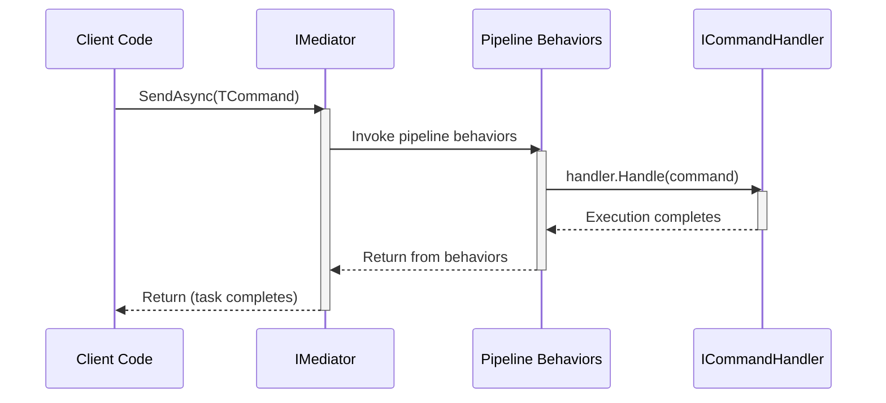

Cortex.Mediator is an implementation of the Mediator design pattern tailored for CQRS-based systems. It centralizes the sending of commands, querying for data, and publishing of notifications, while supporting pluggable pipeline behaviors (e.g., transactions, logging, validation).

## Key Concepts in Cortex.Mediator

### Commands
- **Purpose**: Change system state with or without (`Cortex.Mediator.Unit`) returning a value (e.g., create or update actions).
- **Marker Interface**: `ICommand<TResult>`
- **Handler Interface**: `ICommandHandler<TCommand, TResult>`
- **Pipeline Behavior**: `ICommandPipelineBehavior<TCommand, TResult>`

### Queries
- **Purpose**: Retrieve or compute data without modifying system state.
- **Marker Interface**: `IQuery<TResult>`
- **Handler Interface**: `IQueryHandler<TQuery, TResult>`
- **Pipeline Behavior**: `IQueryPipelineBehavior<TQuery, TResult>`

### Notifications
- **Purpose**: Broadcast events to one or more handlers without returning values.
- **Marker Interface**: `INotification`
- **Handler Interface**: `INotificationHandler<TNotification>`

### IMediator
- Core Interface: `IMediator`
    - `Task<TResult> SendCommandAsync<TCommand, TResult>(TCommand command, CancellationToken cancellationToken = default)`
    - `Task<TResult> SendQueryAsync<TQuery, TResult>(TQuery query, CancellationToken cancellationToken = default)`
    - `Task PublishAsync<TNotification>(TNotification notification, CancellationToken cancellationToken = default)`

### Pipeline Behaviors
- **Use Cases**: Cross-cutting concerns (logging, validation, transactions, etc.) around command and query execution.

- Examples in this library:
    - **LoggingCommandBehavior** – logs command handling and exceptions.

    > Coming with version v1.8
    
    - **ValidationCommandBehavior** – runs FluentValidation checks on the command/query before handling.

