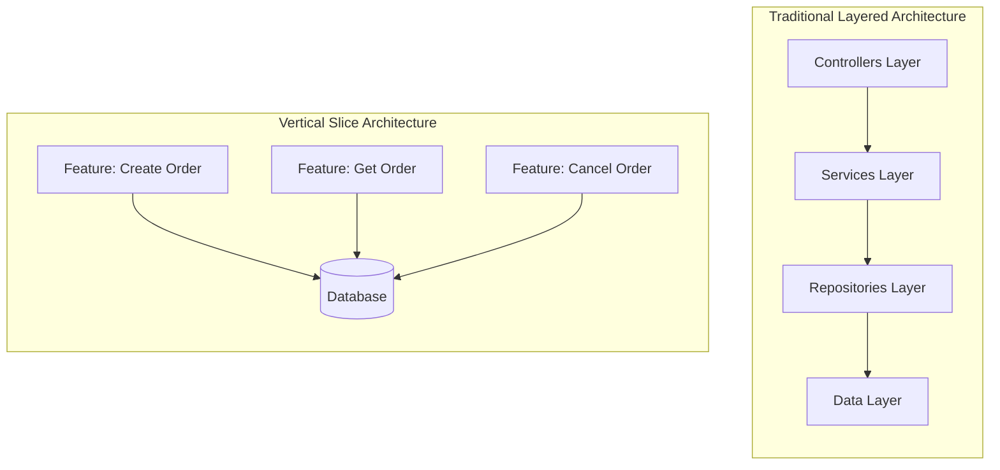

# Vertical Slice Architecture

Vertical Slice Architecture organizes code by **features** rather than technical layers, making it easier to understand, maintain, and scale your application.

## Overview



## Traditional vs. Vertical Slice

### Traditional Layered Structure

```
MyApp/
├── Controllers/
│   ├── OrdersController.cs
│   ├── UsersController.cs
│   └── ProductsController.cs
├── Services/
│   ├── OrderService.cs
│   ├── UserService.cs
│   └── ProductService.cs
├── Repositories/
│   ├── OrderRepository.cs
│   ├── UserRepository.cs
│   └── ProductRepository.cs
├── Models/
│   ├── Order.cs
│   ├── User.cs
│   └── Product.cs
└── DTOs/
    ├── OrderDto.cs
    ├── UserDto.cs
    └── ProductDto.cs
```

**Problems:**
- Changing a feature requires touching multiple folders
- Hard to see what a feature does
- Coupling between layers
- Difficult to test features in isolation

### Vertical Slice Structure

```
MyApp/
├── Features/
│   ├── Orders/
│   │   ├── CreateOrder/
│   │   │   ├── CreateOrderCommand.cs
│   │   │   ├── CreateOrderHandler.cs
│   │   │   ├── CreateOrderValidator.cs
│   │   │   └── CreateOrderEndpoint.cs
│   │   ├── GetOrder/
│   │   │   ├── GetOrderQuery.cs
│   │   │   ├── GetOrderHandler.cs
│   │   │   └── GetOrderEndpoint.cs
│   │   ├── CancelOrder/
│   │   │   ├── CancelOrderCommand.cs
│   │   │   ├── CancelOrderHandler.cs
│   │   │   └── CancelOrderEndpoint.cs
│   │   └── Shared/
│   │       ├── OrderDto.cs
│   │       └── OrderMapper.cs
│   ├── Users/
│   │   ├── RegisterUser/
│   │   ├── GetUser/
│   │   └── UpdateProfile/
│   └── Products/
│       ├── CreateProduct/
│       ├── SearchProducts/
│       └── UpdateInventory/
├── Common/
│   ├── Behaviors/
│   ├── Exceptions/
│   └── Extensions/
└── Infrastructure/
    ├── Data/
    └── Services/
```

**Benefits:**
- All code for a feature in one place
- Easy to understand what a feature does
- Features can be developed independently
- Simple to add, modify, or remove features
- Natural fit for Cortex.Mediator

## Implementing Vertical Slices

### Complete Feature Example: Create Order

```
Features/Orders/CreateOrder/
├── CreateOrderCommand.cs       # Request
├── CreateOrderHandler.cs       # Handler
├── CreateOrderValidator.cs     # Validation
├── CreateOrderEndpoint.cs      # API Endpoint
└── CreateOrderResponse.cs      # Response DTO
```

#### CreateOrderCommand.cs

```csharp
namespace MyApp.Features.Orders.CreateOrder;

public class CreateOrderCommand : ICommand<CreateOrderResponse>
{
    public Guid CustomerId { get; init; }
    public List<OrderItemDto> Items { get; init; } = new();
    public string ShippingAddress { get; init; }
    public string PaymentMethod { get; init; }
}

public class OrderItemDto
{
    public Guid ProductId { get; init; }
    public int Quantity { get; init; }
}
```

#### CreateOrderResponse.cs

```csharp
namespace MyApp.Features.Orders.CreateOrder;

public class CreateOrderResponse
{
    public Guid OrderId { get; init; }
    public string OrderNumber { get; init; }
    public decimal TotalAmount { get; init; }
    public string Status { get; init; }
    public DateTime CreatedAt { get; init; }
}
```

#### CreateOrderValidator.cs

```csharp
namespace MyApp.Features.Orders.CreateOrder;

public class CreateOrderValidator : AbstractValidator<CreateOrderCommand>
{
    public CreateOrderValidator()
    {
        RuleFor(x => x.CustomerId)
            .NotEmpty().WithMessage("Customer is required");

        RuleFor(x => x.Items)
            .NotEmpty().WithMessage("At least one item is required");

        RuleForEach(x => x.Items).ChildRules(item =>
        {
            item.RuleFor(x => x.ProductId).NotEmpty();
            item.RuleFor(x => x.Quantity).GreaterThan(0);
        });

        RuleFor(x => x.ShippingAddress)
            .NotEmpty().WithMessage("Shipping address is required");

        RuleFor(x => x.PaymentMethod)
            .NotEmpty().WithMessage("Payment method is required");
    }
}
```

#### CreateOrderHandler.cs

```csharp
namespace MyApp.Features.Orders.CreateOrder;

public class CreateOrderHandler : ICommandHandler<CreateOrderCommand, CreateOrderResponse>
{
    private readonly ApplicationDbContext _context;
    private readonly IMediator _mediator;
    private readonly ILogger<CreateOrderHandler> _logger;

    public CreateOrderHandler(
        ApplicationDbContext context,
        IMediator mediator,
        ILogger<CreateOrderHandler> logger)
    {
        _context = context;
        _mediator = mediator;
        _logger = logger;
    }

    public async Task<CreateOrderResponse> Handle(
        CreateOrderCommand command,
        CancellationToken cancellationToken)
    {
        _logger.LogInformation(
            "Creating order for customer {CustomerId}",
            command.CustomerId);

        // Get products
        var productIds = command.Items.Select(i => i.ProductId).ToList();
        var products = await _context.Products
            .Where(p => productIds.Contains(p.Id))
            .ToDictionaryAsync(p => p.Id, cancellationToken);

        // Create order
        var order = new Order
        {
            Id = Guid.NewGuid(),
            OrderNumber = GenerateOrderNumber(),
            CustomerId = command.CustomerId,
            ShippingAddress = command.ShippingAddress,
            PaymentMethod = command.PaymentMethod,
            Status = OrderStatus.Pending,
            CreatedAt = DateTime.UtcNow
        };

        // Add items
        foreach (var item in command.Items)
        {
            var product = products[item.ProductId];
            order.Items.Add(new OrderItem
            {
                ProductId = item.ProductId,
                ProductName = product.Name,
                Quantity = item.Quantity,
                UnitPrice = product.Price
            });
        }

        order.TotalAmount = order.Items.Sum(i => i.Quantity * i.UnitPrice);

        _context.Orders.Add(order);
        await _context.SaveChangesAsync(cancellationToken);

        // Publish notification
        await _mediator.PublishAsync(new OrderCreatedNotification
        {
            OrderId = order.Id,
            CustomerId = order.CustomerId,
            TotalAmount = order.TotalAmount
        }, cancellationToken);

        _logger.LogInformation(
            "Order {OrderNumber} created successfully",
            order.OrderNumber);

        return new CreateOrderResponse
        {
            OrderId = order.Id,
            OrderNumber = order.OrderNumber,
            TotalAmount = order.TotalAmount,
            Status = order.Status.ToString(),
            CreatedAt = order.CreatedAt
        };
    }

    private string GenerateOrderNumber()
    {
        return $"ORD-{DateTime.UtcNow:yyyyMMdd}-{Guid.NewGuid().ToString()[..8].ToUpper()}";
    }
}
```

#### CreateOrderEndpoint.cs

```csharp
namespace MyApp.Features.Orders.CreateOrder;

public static class CreateOrderEndpoint
{
    public static void MapCreateOrderEndpoint(this IEndpointRouteBuilder app)
    {
        app.MapPost("/api/orders", async (
            CreateOrderCommand command,
            IMediator mediator,
            CancellationToken cancellationToken) =>
        {
            var result = await mediator.SendAsync(command, cancellationToken);
            return Results.Created($"/api/orders/{result.OrderId}", result);
        })
        .WithName("CreateOrder")
        .WithTags("Orders")
        .Produces<CreateOrderResponse>(StatusCodes.Status201Created)
        .ProducesValidationProblem()
        .RequireAuthorization();
    }
}
```

### Complete Feature Example: Get Order

```
Features/Orders/GetOrder/
├── GetOrderQuery.cs
├── GetOrderHandler.cs
├── GetOrderEndpoint.cs
└── OrderDetailResponse.cs
```

#### GetOrderQuery.cs

```csharp
namespace MyApp.Features.Orders.GetOrder;

[Cacheable(AbsoluteExpirationSeconds = 60)]
public class GetOrderQuery : IQuery<OrderDetailResponse>
{
    public Guid OrderId { get; init; }
}
```

#### OrderDetailResponse.cs

```csharp
namespace MyApp.Features.Orders.GetOrder;

public class OrderDetailResponse
{
    public Guid Id { get; init; }
    public string OrderNumber { get; init; }
    public string CustomerName { get; init; }
    public string CustomerEmail { get; init; }
    public List<OrderItemResponse> Items { get; init; }
    public decimal Subtotal { get; init; }
    public decimal Tax { get; init; }
    public decimal TotalAmount { get; init; }
    public string ShippingAddress { get; init; }
    public string Status { get; init; }
    public DateTime CreatedAt { get; init; }
    public DateTime? ShippedAt { get; init; }
}

public class OrderItemResponse
{
    public string ProductName { get; init; }
    public int Quantity { get; init; }
    public decimal UnitPrice { get; init; }
    public decimal Total { get; init; }
}
```

#### GetOrderHandler.cs

```csharp
namespace MyApp.Features.Orders.GetOrder;

public class GetOrderHandler : IQueryHandler<GetOrderQuery, OrderDetailResponse>
{
    private readonly ApplicationDbContext _context;

    public GetOrderHandler(ApplicationDbContext context)
    {
        _context = context;
    }

    public async Task<OrderDetailResponse> Handle(
        GetOrderQuery query,
        CancellationToken cancellationToken)
    {
        var order = await _context.Orders
            .AsNoTracking()
            .Include(o => o.Customer)
            .Include(o => o.Items)
            .FirstOrDefaultAsync(o => o.Id == query.OrderId, cancellationToken);

        if (order == null)
        {
            throw new NotFoundException(nameof(Order), query.OrderId);
        }

        return new OrderDetailResponse
        {
            Id = order.Id,
            OrderNumber = order.OrderNumber,
            CustomerName = order.Customer.FullName,
            CustomerEmail = order.Customer.Email,
            Items = order.Items.Select(i => new OrderItemResponse
            {
                ProductName = i.ProductName,
                Quantity = i.Quantity,
                UnitPrice = i.UnitPrice,
                Total = i.Quantity * i.UnitPrice
            }).ToList(),
            Subtotal = order.Items.Sum(i => i.Quantity * i.UnitPrice),
            Tax = order.Tax,
            TotalAmount = order.TotalAmount,
            ShippingAddress = order.ShippingAddress,
            Status = order.Status.ToString(),
            CreatedAt = order.CreatedAt,
            ShippedAt = order.ShippedAt
        };
    }
}
```

#### GetOrderEndpoint.cs

```csharp
namespace MyApp.Features.Orders.GetOrder;

public static class GetOrderEndpoint
{
    public static void MapGetOrderEndpoint(this IEndpointRouteBuilder app)
    {
        app.MapGet("/api/orders/{orderId:guid}", async (
            Guid orderId,
            IMediator mediator,
            CancellationToken cancellationToken) =>
        {
            var query = new GetOrderQuery { OrderId = orderId };
            var result = await mediator.QueryAsync(query, cancellationToken);
            return Results.Ok(result);
        })
        .WithName("GetOrder")
        .WithTags("Orders")
        .Produces<OrderDetailResponse>()
        .ProducesProblem(StatusCodes.Status404NotFound)
        .RequireAuthorization();
    }
}
```

## Organizing Shared Code

### Feature-Shared Code

Code shared within a feature domain:

```
Features/Orders/Shared/
├── OrderDto.cs                 # Shared DTOs
├── OrderMapper.cs              # Mapping extensions
├── OrderStatus.cs              # Enums
└── IOrderRepository.cs         # Feature-specific repository interface
```

### Application-Wide Shared Code

```
Common/
├── Behaviors/
│   ├── LoggingBehavior.cs
│   ├── ValidationBehavior.cs
│   └── TransactionBehavior.cs
├── Exceptions/
│   ├── NotFoundException.cs
│   ├── ValidationException.cs
│   └── ForbiddenException.cs
├── Extensions/
│   ├── ServiceCollectionExtensions.cs
│   └── EndpointRouteExtensions.cs
└── Models/
    ├── PagedResult.cs
    └── Result.cs
```

## Registering Endpoints

### Using Extension Methods

```csharp
// Features/Orders/OrderEndpoints.cs
namespace MyApp.Features.Orders;

public static class OrderEndpoints
{
    public static void MapOrderEndpoints(this IEndpointRouteBuilder app)
    {
        var group = app.MapGroup("/api/orders")
            .WithTags("Orders")
            .RequireAuthorization();

        group.MapCreateOrderEndpoint();
        group.MapGetOrderEndpoint();
        group.MapGetOrdersEndpoint();
        group.MapCancelOrderEndpoint();
        group.MapShipOrderEndpoint();
    }
}

// Program.cs
app.MapOrderEndpoints();
app.MapUserEndpoints();
app.MapProductEndpoints();
```

### Auto-Discovery

```csharp
// Common/Extensions/EndpointExtensions.cs
public static class EndpointExtensions
{
    public static void MapFeatureEndpoints(this IEndpointRouteBuilder app)
    {
        // Discover and register all endpoint configurations
        var endpointTypes = typeof(Program).Assembly
            .GetTypes()
            .Where(t => t.IsClass && !t.IsAbstract)
            .Where(t => t.GetInterfaces().Contains(typeof(IEndpointConfiguration)));

        foreach (var type in endpointTypes)
        {
            var instance = (IEndpointConfiguration)Activator.CreateInstance(type)!;
            instance.ConfigureEndpoints(app);
        }
    }
}

public interface IEndpointConfiguration
{
    void ConfigureEndpoints(IEndpointRouteBuilder app);
}

// Features/Orders/CreateOrder/CreateOrderEndpoint.cs
public class CreateOrderEndpointConfig : IEndpointConfiguration
{
    public void ConfigureEndpoints(IEndpointRouteBuilder app)
    {
        app.MapPost("/api/orders", async (CreateOrderCommand command, IMediator mediator) =>
        {
            var result = await mediator.SendAsync(command);
            return Results.Created($"/api/orders/{result.OrderId}", result);
        });
    }
}
```

## Feature Folder Naming Conventions

### Command Features (Write Operations)

```
Features/{Domain}/{Action}{Entity}/
├── {Action}{Entity}Command.cs
├── {Action}{Entity}Handler.cs
├── {Action}{Entity}Validator.cs
├── {Action}{Entity}Endpoint.cs
└── {Action}{Entity}Response.cs (optional)

Examples:
- Features/Orders/CreateOrder/
- Features/Users/RegisterUser/
- Features/Products/UpdateInventory/
- Features/Payments/ProcessPayment/
```

### Query Features (Read Operations)

```
Features/{Domain}/{Action}{Entity}/
├── {Action}{Entity}Query.cs
├── {Action}{Entity}Handler.cs
├── {Action}{Entity}Endpoint.cs
└── {Entity}{Detail}Response.cs

Examples:
- Features/Orders/GetOrder/
- Features/Orders/ListOrders/
- Features/Users/SearchUsers/
- Features/Products/GetProductDetails/
```

### Notification Features (Events)

```
Features/{Domain}/Events/
├── {Entity}{Event}Notification.cs
├── {Handler1}Handler.cs
├── {Handler2}Handler.cs
└── {Handler3}Handler.cs

Examples:
- Features/Orders/Events/OrderCreatedNotification.cs
- Features/Orders/Events/SendOrderConfirmationHandler.cs
- Features/Orders/Events/UpdateInventoryHandler.cs
```

## Testing Vertical Slices

### Unit Testing a Handler

```csharp
public class CreateOrderHandlerTests
{
    private readonly ApplicationDbContext _context;
    private readonly Mock<IMediator> _mediatorMock;
    private readonly CreateOrderHandler _handler;

    public CreateOrderHandlerTests()
    {
        var options = new DbContextOptionsBuilder<ApplicationDbContext>()
            .UseInMemoryDatabase(Guid.NewGuid().ToString())
            .Options;

        _context = new ApplicationDbContext(options);
        _mediatorMock = new Mock<IMediator>();
        _handler = new CreateOrderHandler(
            _context,
            _mediatorMock.Object,
            Mock.Of<ILogger<CreateOrderHandler>>());
    }

    [Fact]
    public async Task Handle_ValidCommand_CreatesOrder()
    {
        // Arrange
        var product = new Product { Id = Guid.NewGuid(), Name = "Test Product", Price = 10.00m };
        _context.Products.Add(product);
        await _context.SaveChangesAsync();

        var command = new CreateOrderCommand
        {
            CustomerId = Guid.NewGuid(),
            Items = new List<OrderItemDto>
            {
                new() { ProductId = product.Id, Quantity = 2 }
            },
            ShippingAddress = "123 Main St",
            PaymentMethod = "Credit Card"
        };

        // Act
        var result = await _handler.Handle(command, CancellationToken.None);

        // Assert
        Assert.NotEqual(Guid.Empty, result.OrderId);
        Assert.Equal(20.00m, result.TotalAmount);
        Assert.Equal("Pending", result.Status);

        var savedOrder = await _context.Orders.FindAsync(result.OrderId);
        Assert.NotNull(savedOrder);
    }
}
```

### Integration Testing an Endpoint

```csharp
public class CreateOrderEndpointTests : IClassFixture<WebApplicationFactory<Program>>
{
    private readonly HttpClient _client;

    public CreateOrderEndpointTests(WebApplicationFactory<Program> factory)
    {
        _client = factory.CreateClient();
    }

    [Fact]
    public async Task CreateOrder_ValidRequest_ReturnsCreated()
    {
        // Arrange
        var command = new CreateOrderCommand
        {
            CustomerId = Guid.NewGuid(),
            Items = new List<OrderItemDto>
            {
                new() { ProductId = Guid.NewGuid(), Quantity = 1 }
            },
            ShippingAddress = "123 Main St",
            PaymentMethod = "Credit Card"
        };

        // Act
        var response = await _client.PostAsJsonAsync("/api/orders", command);

        // Assert
        Assert.Equal(HttpStatusCode.Created, response.StatusCode);

        var result = await response.Content.ReadFromJsonAsync<CreateOrderResponse>();
        Assert.NotNull(result);
        Assert.NotEqual(Guid.Empty, result.OrderId);
    }

    [Fact]
    public async Task CreateOrder_NoItems_ReturnsBadRequest()
    {
        // Arrange
        var command = new CreateOrderCommand
        {
            CustomerId = Guid.NewGuid(),
            Items = new List<OrderItemDto>(),
            ShippingAddress = "123 Main St",
            PaymentMethod = "Credit Card"
        };

        // Act
        var response = await _client.PostAsJsonAsync("/api/orders", command);

        // Assert
        Assert.Equal(HttpStatusCode.BadRequest, response.StatusCode);
    }
}
```

## Best Practices

### ✅ DO

- **Keep features cohesive** - All related code in one folder
- **Use meaningful names** - Feature folders should describe the action
- **Separate commands and queries** - Follow CQRS principles
- **Share minimally** - Only share truly common code
- **Test features in isolation** - Each feature should be independently testable
- **Use DTOs specific to features** - Avoid sharing DTOs across features
- **Keep handlers focused** - One handler, one action

### ❌ DON'T

- **Don't create deep nesting** - Keep folder structure flat
- **Don't share handlers** - Each feature has its own
- **Don't over-abstract** - Start simple, refactor when needed
- **Don't forget validation** - Every command needs a validator
- **Don't couple features** - Features should be independent
