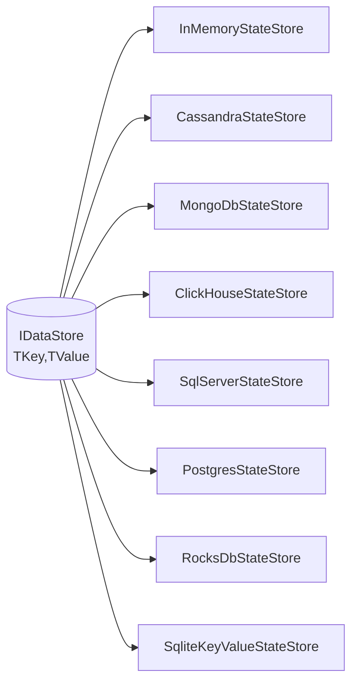

State Stores are integral components of the Cortex Framework that enable operators to maintain and manage state across data items and stream processing tasks. They provide mechanisms to store, retrieve, and persist state information, ensuring data consistency, fault tolerance, and efficient stream processing.

## Introduction to State Stores

State Stores facilitate the management of stateful operations within stream processing pipelines. They are essential for operators that require access to historical data, aggregations, windowed computations, and other state-dependent functionalities. By persisting state information, State Stores ensure that stream processing can recover gracefully from failures and maintain data integrity.

**Key Features:**

- **Persistence**: Some state stores offer durable storage to retain state information across restarts and failures.
- **In-Memory Storage**: Provides fast access to state data, suitable for scenarios where persistence is not required.
- **Scalability**: Supports distributed state management to handle high-throughput and large-scale streaming applications.
- **Fault Tolerance**: Ensures state consistency and availability even in the face of system failures.
- **Integration with Operators**: Seamlessly integrates with various operators (e.g., Aggregate, Window) to manage their stateful computations.

**Types of State Stores:**

1. **RocksDbStateStore**:
   - Description: A persistent, high-performance key-value store based on RocksDB, suitable for applications requiring durable state management.
2. **In-Memory State Stores**:
   - Description: Provides fast, non-persistent state storage, ideal for scenarios where state does not need to survive application restarts.
3. **SqlServerStateStore** & **SqlServerKeyValueStateStore**:
   - Description: A state store backed by Microsoft SQL Server, providing durable and scalable state management with robust transactional support.
4. **PostgresStateStore** & **PostgresKeyValueStateStore**:
   - Description: A state store backed by PostgreSQL, offering reliable and efficient state management with advanced querying capabilities.
5. **ClickHouseStateStore**:
   - Description: A state store backed by ClickHouse, designed for high-performance analytical processing and large-scale state management.
6. **CassandraStateStore**:
   - Description: A state store backed by Apache Cassandra, providing distributed and fault-tolerant state management for high availability.
7. **MongoDbStateStore**:
   - Description: A state store backed by MongoDB, offering flexible and scalable state management with support for complex data structures.
8. **SqliteKeyValueStateStore**:
   - Description: A state store backed by Sqlite, providing durable and scalable state management with robust transactional support.

*More support will arrive later with new versions of Cortex.*

**Choosing the Right State Store:**

* **RocksDbStateStore**: Use when state persistence is crucial, such as in financial transactions, user session tracking, or any application where data loss is unacceptable.
* **In-Memory State Stores**: Opt for in-memory stores for lightweight applications, testing, or scenarios where state can be reconstructed or is transient.
* **SqlServerStateStore** & **SqlServerStateStore**: Ideal for enterprise applications requiring robust transactional support and integration with Microsoft SQL Server.
* **PostgresStateStore** & **PostgresKeyValueStateStore**: Suitable for applications needing reliable state management with advanced querying capabilities provided by PostgreSQL.
* **ClickHouseStateStore**: Best for high-performance analytical processing and large-scale state management scenarios.
* **CassandraStateStore**: Perfect for distributed applications requiring fault-tolerant state management and high availability.
* **MongoDbStateStore**: Great for applications needing flexible and scalable state management with support for complex data structures.

*Figure 1: State Store Integration within the Cortex Data Framework*
