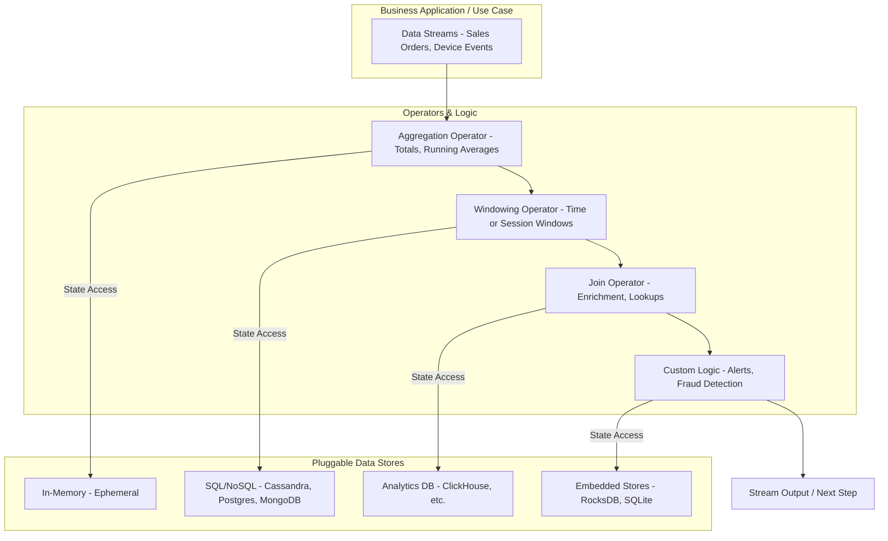

Operators are the building blocks of the Cortex Data Framework's processing pipeline. They define how data flows through the stream, transforming, filtering, aggregating, and ultimately directing the data to its destination. This section explores the different types of operators available, their use cases, implementation details, and code examples to demonstrate their practical application.

## Introduction to Operators

Operators in the Cortex Data Framework are components that process data as it flows through a stream. They can perform various functions such as transforming data, filtering out unwanted data, aggregating information, managing state, and sending data to external systems. Operators can be chained together to form complex processing pipelines tailored to specific application needs.

**Key Features:**
- **Modularity**: Operators can be combined in flexible ways to create diverse data processing workflows.
- **Stateful Processing**: Some operators maintain state across multiple data items, enabling advanced processing like aggregations and windowing.
- **Telemetry Integration**: Operators can integrate with telemetry providers to monitor performance and track processing metrics.
- **Extensibility**: Developers can create custom operators to extend the platform's capabilities.

**Types of Operators:**

1. **Transform Operators**:
   - **Map Operator**: Transforms each data item.
   - **FlatMap Operator**: Transforms each data item into zero or more items.

2. **Filter Operators**:
   - **Filter Operator**: Filters data items based on a predicate.

3. **Aggregate Operators**:
   - **Aggregate Operator**: Aggregates data items based on keys and aggregation functions.

4. **Window Operators**:
   - **Tumbling Window Operator**: Processes data in fixed-size, non-overlapping windows.
   - **Sliding Window Operator**: Processes data in fixed-size, overlapping windows.
   - **Session Window Operator**: Processes data based on sessions with inactivity gaps.

5. **Sink Operators**:
   - **Console Sink**: Outputs data to the console.
   - **AWS SQS Sink**: Sends data to an AWS SQS queue.
   - **Kafka Sink**: Sends data to a Kafka topic.
   - **Apache Pulsar Sink**: Sends data to a Apache Pulsar topic.
   
6. **Source Operators**:
   - **AWS SQS Source**: Receives data from an AWS SQS queue.
   - **Kafka Source**: Receives data from a Kafka topic.
   - **Apache Pulsar Source**: Receives data from a Apache Pulsar topic.
   - **Azure Service Bus Source**: Receives data from an Azure Service Bus queue.

**Operator Interfaces:**
- **IOperator**: The base interface for all operators.
- **IStatefulOperator**: Interface for operators that maintain state.
- **ITelemetryEnabled**: Interface for operators that support telemetry integration.
- **ISinkOperator<T>**: Interface for sink operators that consume data.
- **ISourceOperator<T>**: Interface for source operators that emit data.

**Operator Pipeline Flow:**

- **Source Operator**: Emits data into the stream.
- **Transform/Filter/Aggregate Operators**: Process the data as it flows through the pipeline.
- **Sink Operator**: Consumes and handles the processed data.

**Architecture Diagram:**

Figure 1: Operator Pipeline Architecture
