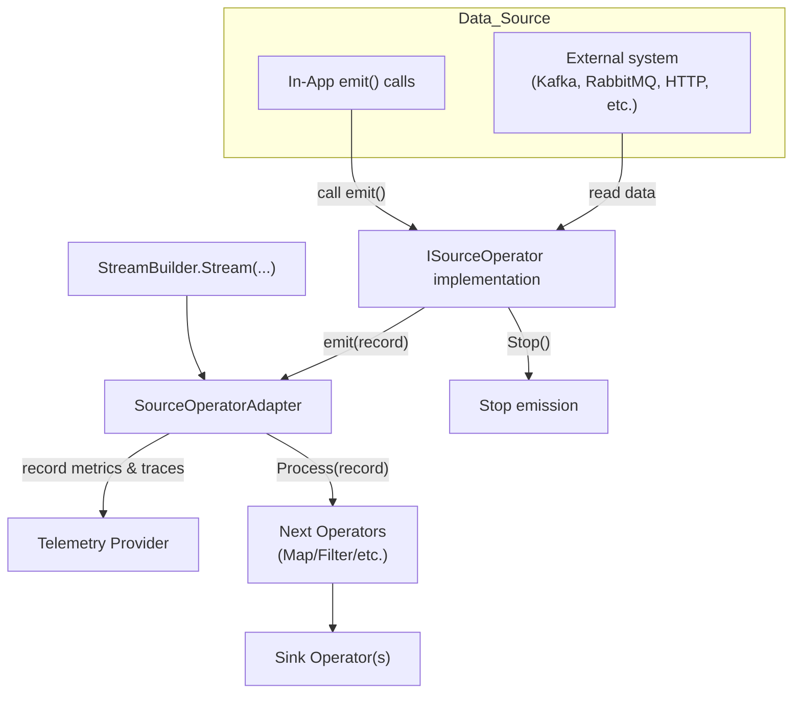

In a Cortex streaming pipeline, **source operators** are the entry points that supply data into the stream. Unlike transformations and sinks, sources do not consume upstream data; instead, they connect to external systems (files, message queues, APIs, databases) or generate data in‑memory and emit records into the pipeline. In this page it explains the general `ISourceOperator` interface, how sources integrate with the stream builder, and how to implement custom sources.

## The `ISourceOperator` interface

At the heart of every source operator is the ISourceOperator interface. It defines two methods:

- `Start(Action<object> emit)` – called by the framework to begin emitting data. It receives an emit callback; whenever your source reads or generates a record, it should call `emit(record)` to push the record downstream. The method should return immediately or spawn background tasks; it must not block the caller.

- `Stop()` – instructs the source to cease emitting and release any resources (e.g., close connections, cancel timers)

A typical source operator creates a loop or attaches to an event source in `Start`, then calls `emit` whenever a new record arrives. It should honour cancellation when `Stop()` is called to allow the stream to shut down gracefully.


## Integration into the pipeline

When you attach a source operator to a stream, it is wrapped by the internal `SourceOperatorAdapter`. This adapter implements the generic `IOperator` interface and bridges the source to the rest of the pipeline. It hooks telemetry (metrics and tracing) and ensures that each emitted record flows to the next operator. Under the hood, the adapter calls your source’s `Start` method and forwards each emitted record to `_nextOperator.Process`. If telemetry is enabled, it increments counters and records emission latency.

## Adding a source to a stream

Use the `StreamBuilder.Stream(ISourceOperator sourceOperator)` method to add a source operator to a new stream. This method validates that exactly one source is added and that it is added before any other operators. Attempting to add multiple sources or adding a source after other transformations will throw an exception. Example:

```csharp
var source = new KafkaSourceOperator<MyEvent>(
    bootstrapServers: "localhost:9092",
    topic: "events");

var stream = StreamBuilder<MyEvent, MyEvent>
    .CreateNewStream("EventStream")
    .Stream(source)            // attach the source
    .Map(e => e with { ProcessedAt = DateTime.UtcNow })
    .Sink(Console.WriteLine)
    .Build();

stream.Start();
```

When you call `Start()` on the stream, the adapter automatically invokes `source.Start(emit)`. Each incoming record is passed to downstream operators via the provided emit callback.

## In-App Streams
If you call `StreamBuilder.Stream()` with **no arguments**, Cortex creates an **in-app source**. In this case there is no external data source; you are responsible for pushing data into the stream. Once the stream is started, you can call `stream.Emit(record)` to feed it records. Note that you cannot call Emit on a stream that has an attached source operator – doing so results in an exception. This design enforces a single entry point for the pipeline.

Example of an in-app stream:

```csharp
var stream = StreamBuilder<int, int>
    .CreateNewStream("Numbers")
    .Stream()           // no external source
    .Filter(x => x % 2 == 0)
    .Sink(Console.WriteLine)
    .Build();

stream.Start();

// emit values manually
stream.Emit(1);   // will be ignored by filter
stream.Emit(2);   // printed to console
stream.Emit(3);
stream.Emit(4);
```

## Writing a custom source operator

Cortex’s built‑in packages provide source operators for Kafka, Pulsar, RabbitMQ, AWS SQS, Azure Service Bus, files, HTTP polling and more. You can also implement your own `ISourceOperator` to integrate with other systems or to generate synthetic data. A custom implementation typically looks like this:

```csharp
public class TimerSourceOperator : ISourceOperator
{
    private Timer _timer;
    private Action<object> _emit;

    public void Start(Action<object> emit)
    {
        _emit = emit;
        // create a timer that fires every second
        _timer = new Timer(_ =>
        {
            var value = DateTime.UtcNow;
            _emit(value); // emit current time
        }, null, TimeSpan.Zero, TimeSpan.FromSeconds(1));
    }

    public void Stop()
    {
        _timer?.Dispose();
    }
}

// attach the custom source
var stream = StreamBuilder<DateTime, DateTime>
    .CreateNewStream("TimeStream")
    .Stream(new TimerSourceOperator())
    .Sink(time => Console.WriteLine($"Current time: {time}"))
    .Build();

stream.Start();

```

This example uses a `System.Threading.Timer` to emit the current time every second. When the stream is stopped, the timer is disposed via `Stop()`, preventing further emissions.


Figure 1: Source Operator Pipeline Flow

## Best practices

- **Non‑blocking** `Start` – avoid blocking the thread that calls `Start`. Instead, start background tasks or timers. The `emit` callback can be called concurrently from multiple threads; ensure thread safety if you access shared state.

- **Respect cancellation** – implement `Stop` to cancel any background operations. This ensures that the stream can shut down cleanly.

- **Back‑pressure** – Cortex currently does not provide built‑in back‑pressure for sources. Throttle your emissions or use batching if the downstream pipeline cannot keep up.

- **Telemetry** – when telemetry is configured on the stream, Cortex automatically records metrics on emitted item count and emission latency via the `SourceOperatorAdapter`.