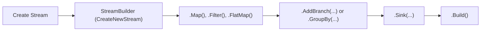

Stream Builders are the foundational components in the Cortex Data Framework that allow developers to construct and configure stream processing pipelines. They provide a fluent API to add various operators, configure telemetry, and manage the lifecycle of streams. This section delves into the essentials of Stream Builders, guiding you through their overview, creation, telemetry configuration, building and starting streams, and managing their lifecycle.

***

## Overview of Stream Builders

Stream Builders are designed to simplify the construction of stream processing pipelines by providing a flexible and intuitive API. They enable developers to define the flow of data through a series of operators, manage state stores, and integrate telemetry for monitoring and diagnostics.

**Key Features:**

- **Fluent API**: Allows chaining of methods for a more readable and maintainable stream configuration.
- **Operator Integration**: Easily add various operators like map, filter, aggregate, and window operators to process data.
- **Telemetry Configuration**: Integrate telemetry providers to monitor stream performance and health.
- **Lifecycle Management**: Control the starting, stopping, and status checking of streams seamlessly.

**Core Components:**

- **StreamBuilder<TIn>**: The primary class used to build and configure streams.
- **Operators**: Components that define how data is processed within the stream (e.g., MapOperator, FilterOperator).
- **State Stores**: Manage stateful operations within streams (e.g., RocksDbStateStore).
- **Telemetry Providers**: Integrate monitoring and diagnostics (e.g., OpenTelemetry).



Figure 3.1: Overview of Stream Builder Architecture


## Creating a Stream

Creating a stream involves initializing a `StreamBuilder`, configuring the necessary operators, and defining the data flow. Here's a step-by-step guide to creating a simple stream.

**Step 1: Initialize the StreamBuilder**\
Start by creating a new stream using the `StreamBuilder` class. Specify the input and current data types.

```csharp
using Cortex.Streams;

// Initialize a new stream with input type int
var streamBuilder = StreamBuilder<int>.CreateNewStream("Example Stream");
```

**Step 2: Add Operators**\
Add operators to process the data. For instance, add a `Map` operator to transform the data and a `Sink` operator to consume the output.

```csharp
streamBuilder
    .Stream()
    .Map(x => x * 2)           // Transform each input by multiplying by 2
    .Sink(Console.WriteLine);  // Output the transformed data to the console
```

**Step 3: Build the Stream**\
Finalize the stream configuration by building it. This returns an `IStream` instance that can be started and managed.

```csharp
IStream<int, int> stream = streamBuilder.Build();
```

**Complete Example:**

```csharp
using Cortex.Streams;
using System;

class Program
{
    static void Main(string[] args)
    {
        var stream = StreamBuilder<int>.CreateNewStream("Example Stream")
            .Stream()
            .Map(x => x * 2)
            .Sink(Console.WriteLine)
            .Build();

        stream.Start();

        // Emit data into the stream
        for (int i = 1; i <= 5; i++)
        {
            stream.Emit(i);
        }

        // Stop the stream after processing
        stream.Stop();
    }
}
```

**Output:**

```csharp
2
4
6
8
10
```


## Configuring Telemetry
Telemetry integration is crucial for monitoring the performance and health of your streams. Cortex Data Framework supports various telemetry providers, enabling you to collect metrics, traces, and logs seamlessly.

**Step 1: Implement a Telemetry Provider**\
Before configuring telemetry in your stream, ensure you have an implementation of `ITelemetryProvider`. Cortex supports providers like OpenTelemetry, but you can implement your own as needed.

```csharp
using Cortex.Telemetry;

public class CustomTelemetryProvider : ITelemetryProvider
{
    public IMetricsProvider GetMetricsProvider()
    {
        // Implement metrics provider
    }

    public ITracingProvider GetTracingProvider()
    {
        // Implement tracing provider
    }
}
```

**Step 2: Integrate Telemetry Provider with StreamBuilder**\
Use the `WithTelemetry` method to integrate your telemetry provider with the stream.

```csharp
using Cortex.Streams;
using Cortex.Telemetry;

// Initialize telemetry provider
ITelemetryProvider telemetryProvider = new CustomTelemetryProvider();

// Create and configure the stream with telemetry
var streamBuilder = StreamBuilder<int>.CreateNewStream("Telemetry Stream")
    .WithTelemetry(telemetryProvider)
    .Stream()
    .Map(x => x * 2)
    .Sink(Console.WriteLine)
    .Build();

streamBuilder.Start();
```

**Benefits of Configuring Telemetry:**
- **Performance Monitoring**: Track metrics like processing time, throughput, and error rates.
- **Diagnostics**: Use traces to identify bottlenecks and failures within the stream.
- **Alerting**: Set up alerts based on specific metric thresholds to proactively manage stream health.

**Code Example:**

```csharp
using Cortex.Streams;
using Cortex.Telemetry;
using System;

class Program
{
    static void Main(string[] args)
    {
        // Initialize telemetry provider (e.g., OpenTelemetry)
        ITelemetryProvider telemetryProvider = new OpenTelemetryProvider();

        var stream = StreamBuilder<int>.CreateNewStream("Telemetry Stream")
            .Stream()
            .WithTelemetry(telemetryProvider)
            .Map(x => x * 2)
            .Sink(Console.WriteLine)
            .Build();

        stream.Start();

        // Emit data into the stream
        for (int i = 1; i <= 5; i++)
        {
            stream.Emit(i);
        }

        // Stop the stream after processing
        stream.Stop();
    }
}
```

*Note*: Replace OpenTelemetryProvider with your actual telemetry provider implementation.


## Building and Starting the Stream

After configuring the stream with the desired operators and telemetry if needed, the next steps involve building the stream and initiating its processing.

**Step 1: Build the Stream**\
Use the `Build()` method on the `StreamBuilder` to finalize the stream configuration. This method returns an `IStream` instance.
```csharp
IStream<int, int> stream = streamBuilder.Build();
```

**Step 2: Start the stream**\
Invoke the `Start()` method on the `IStream` instance to begin processing. This sets up the stream's internal mechanisms and prepares it to receive data.

```csharp
stream.Start();
```

**Step 3: Emit Data**\
Depending on whether your stream has a source operator or not, you can emit data directly using the `Emit` method. If a source operator is configured (e.g., `SQSSourceOperator` or `KafkaSourceOperator`), the stream will receive data from *external sources*, and **manual emission is not possible**.

```csharp
// Emit data manually if no source operator is configured
stream.Emit(10);
stream.Emit(20);
stream.Emit(30);
```


**Step 4: Stop the Stream**\
Once data processing is complete or when you need to gracefully shut down the stream, call the `Stop()` method. This halts the stream's processing and releases any resources.

```csharp
stream.Stop();
```
**Complete Example:**

```csharp
using Cortex.Streams;
using System;

class Program
{
    static void Main(string[] args)
    {
        var stream = StreamBuilder<int>.CreateNewStream("Processing Stream")
            .Stream()
            .Map(x => x + 5)
            .Sink(x => Console.WriteLine($"Processed Value: {x}"))
            .Build();

        // Start the stream
        stream.Start();

        // Emit data
        stream.Emit(10); // Output: Processed Value: 15
        stream.Emit(20); // Output: Processed Value: 25
        stream.Emit(30); // Output: Processed Value: 35

        // Stop the stream
        stream.Stop();
    }
}
```


## Managing Stream Lifecycle (Start, Stop, Status)

Efficient management of the stream's lifecycle ensures optimal resource utilization and controlled data processing. Cortex provides straightforward methods to manage the stream's state.

### Start the Stream
Initiates the stream's processing. Once started, the stream begins processing incoming data based on the configured operators.

```csharp
stream.Start();
```

**Usage Scenario:**
- **Initialization**: Start the stream after all configurations and operator setups are complete.
- **Automated Start**: Integrate stream start logic within application initialization routines..

### Stop the Stream
Gracefully stops the stream's processing. This halts data processing, ensures all in-flight data is handled, and releases any allocated resources.

```csharp
stream.Stop();
```

**Usage Scenario:**

- **Shutdown Procedures**: Stop the stream during application shutdown to ensure all data is processed.
- **Maintenance**: Temporarily stop the stream for maintenance or configuration changes.

### Check Stream Status
Retrieve the current status of the stream to determine if it's running or stopped. This is useful for monitoring and debugging purposes.

```csharp
string status = stream.GetStatus();
Console.WriteLine($"Stream Status: {status}");
```

**Possible Status Values**:

- `"Running"`: The stream is actively processing data.
- `"Stopped"`: The stream is not processing data.

### Complete Lifecycle Management Example

```csharp
using Cortex.Streams;
using System;

class Program
{
    static void Main(string[] args)
    {
        var stream = StreamBuilder<string>.CreateNewStream("Lifecycle Stream")
            .Stream()
            .Map(message => $"Processed: {message.ToUpper()}")
            .Sink(Console.WriteLine)
            .Build();

        // Check initial status
        Console.WriteLine($"Initial Status: {stream.GetStatus()}"); // Output: Stopped

        // Start the stream
        stream.Start();
        Console.WriteLine($"Status after Start: {stream.GetStatus()}"); // Output: Running

        // Emit data
        stream.Emit("hello"); // Output: Processed: HELLO
        stream.Emit("world"); // Output: Processed: WORLD

        // Stop the stream
        stream.Stop();
        Console.WriteLine($"Status after Stop: {stream.GetStatus()}"); // Output: Stopped

        // Attempt to emit data after stopping (will throw an exception)
        try
        {
            stream.Emit("test");
        }
        catch (InvalidOperationException ex)
        {
            Console.WriteLine($"Error: {ex.Message}"); // Output: Stream has not been started.
        }
    }
}
```

*Output:*
```csharp
Initial Status: Stopped
Status after Start: Running
Processed: HELLO
Processed: WORLD
Status after Stop: Stopped
Error: Stream has not been started.
```

### Complete Lifecycle Management Example

- **Graceful Shutdown**: Always stop streams gracefully to ensure all data is processed and resources are released.
- **Error Handling**: Implement error handling around Start and Stop methods to manage unexpected scenarios.
- **Status Monitoring**: Regularly check the stream status to monitor its health and respond to state changes accordingly.